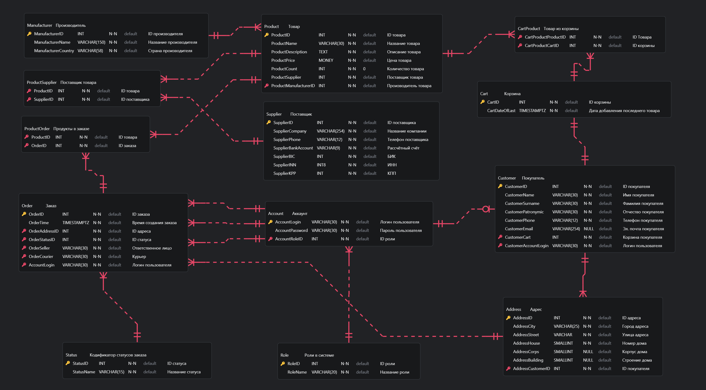

# Практическая работа №2

> Задание. Построить EntityRelationship-диаграмму базы данных онлайн-магазина товаров

ER-диаграмма базы данных магазина товаров

1. Сущность `Account` - аккаунт. Хранит информацию об учётных записях в системе, сопоставляя им соответствующие роли.

2. Сущность `Address` - адрес. Представляет собой записи об адресах. Связана внешним ключом с `Customer`.

3. Сущность `Cart` - корзина. Имеет дату добавления последнего товара.

4. Сущность `CartProduct` реализует связь М:М между `Cart` и `Product`.

5. Сущность `Customer` - покупатель. Представляет собой записи с контактной информацией о покупателе, а также по внешнему ключу связана с `Account` и `Cart` (покупатель имеет свой аккаунт и корзину).

6. Сущность `Manufacturer` - производитель товара. Представляет собой записи о данных производителей, известных системе.

7. Сущность `Order` - заказ. Представляет собой заказы покупателей. По внешним ключам связана `Address` (куда доставлять заказ), `Status` (в каком состоянии заказ) и трижды с `Account` (Ответственное лицо, курьер и покупатель).

8. Сущность `Product` - товар. Представляет собой позицию ассортимента магазина. Имеет название, количество, отражающее остаток на складе, поставщика и производителя. С последним связана внешним ключом.

9. Сушность `ProductOrder` реализует связь М:М между `Product` и `Order`.

9. Сущность `ProductSupplier` реализует связь М:М между `Product` и `Supplier`.

10. Сущность `Role` - роль. Является кодификатором ролей пользователей, существующих в системе.

11. Сущность `Status` - статус заказа. Является кодификатором статусов, которые могут быть у заказа.

12. Сущность `Supplier` - поставщик товара. Представляет собой записи о данных поставщиков, известных системе.

