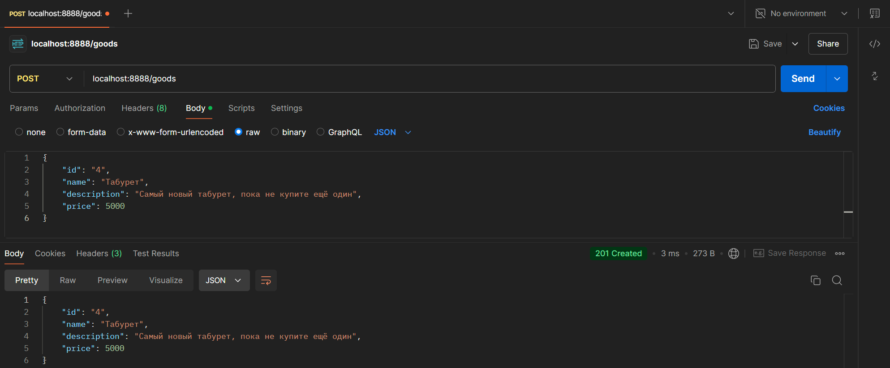

# Практическая работа №7. REST API

## Установка зависимостей (Gin и Swag и Middleware для Swagger)
```bash
go get -u github.com/gin-gonic/gin
go install github.com/swaggo/swag/cmd/swag@latest
go get -u github.com/swaggo/http-swagger
```

## Структура проекта


---

## Содержимое файла main.go
```go
package main

import (
	"github.com/gin-gonic/gin"
	"github.com/swaggo/http-swagger"
	"log"
	"net/http"
	_ "restApi/docs"
)

type Good struct {
	ID          string  `json:"id" example:"1"`
	Name        string  `json:"name" example:"Стол"`
	Description string  `json:"description" example:"Обычный деревянный стол"`
	Price       float32 `json:"price" example:"10000.0"`
}

type ErrorResponse struct {
	Error string `json:"error" example:"id not found"`
}

var goods = []Good{
	{
		ID:          "1",
		Name:        "Стол",
		Description: "Обычный деревянный стол",
		Price:       10000.0,
	},
	{
		ID:          "2",
		Name:        "Стул",
		Description: "Обычный железный стул",
		Price:       3000.0,
	},
	{
		ID:          "3",
		Name:        "Ковёр",
		Description: "Красный совковый ковёр",
		Price:       5000.0,
	},
}

// @Summary Получить все товары
// @Description Возвращает список всех товаров
// @Tags goods
// @Produce json
// @Success 200 {array} Good
// @Router /goods [get]
func getGoods(c *gin.Context) {
	c.JSON(http.StatusOK, goods)
}

// @Summary Получить товар по ID
// @Description Возвращает информацию о товаре по его ID
// @Tags goods
// @Produce json
// @Param id path string true "ID товара"
// @Success 200 {object} Good
// @Failure 404 {object} ErrorResponse
// @Router /goods/{id} [get]
func getGood(c *gin.Context) {
	id := c.Param("id")

	for _, good := range goods {
		if good.ID == id {
			c.JSON(http.StatusOK, good)
			return
		}
	}
	c.JSON(http.StatusNotFound, ErrorResponse{Error: "id not found"})
}

// @Summary Создать новый товар
// @Description Добавляет новый товар в список
// @Tags goods
// @Accept json
// @Produce json
// @Param good body Good true "Информация о товаре"
// @Success 201 {object} Good
// @Failure 400 {object} ErrorResponse
// @Router /goods [post]
func createGood(c *gin.Context) {
	var newGood Good

	if err := c.ShouldBind(&newGood); err != nil {
		c.JSON(http.StatusBadRequest, ErrorResponse{Error: err.Error()})
		return
	}

	goods = append(goods, newGood)
	c.JSON(http.StatusCreated, newGood)
}

// @Summary Обновить существующий товар
// @Description Обновляет данные товара по ID
// @Tags goods
// @Accept json
// @Produce json
// @Param id path string true "ID товара"
// @Param good body Good true "Новые данные товара"
// @Success 200 {object} Good
// @Failure 400 {object} ErrorResponse
// @Failure 404 {object} ErrorResponse
// @Router /goods/{id} [put]
func updateGood(c *gin.Context) {
	id := c.Param("id")
	var updatedGood Good

	if err := c.ShouldBind(&updatedGood); err != nil {
		c.JSON(http.StatusBadRequest, ErrorResponse{Error: err.Error()})
		return
	}

	for i, good := range goods {
		if good.ID == id {
			goods[i] = updatedGood
			c.JSON(http.StatusOK, updatedGood)
			return
		}
	}
	c.JSON(http.StatusNotFound, ErrorResponse{Error: "id not found"})
}

// @Summary Удалить товар
// @Description Удаляет товар по ID
// @Tags goods
// @Produce json
// @Param id path string true "ID товара"
// @Success 200 {object} Good
// @Failure 404 {object} ErrorResponse
// @Router /goods/{id} [delete]
func deleteGood(c *gin.Context) {
	id := c.Param("id")

	for i, good := range goods {
		if good.ID == id {
			goods = append(goods[:i], goods[i+1:]...)
			c.JSON(http.StatusOK, good)
			return
		}
	}
	c.JSON(http.StatusNotFound, ErrorResponse{Error: "id not found"})
}

func main() {
	router := gin.Default()

	// Получение всех товаров
	router.GET("/goods", getGoods)

	// Получение товара по ID
	router.GET("/goods/:id", getGood)

	// Создание нового товара
	router.POST("/goods", createGood)

	// Обновление существующего товара
	router.PUT("/goods/:id", updateGood)

	// Удаление товара
	router.DELETE("/goods/:id", deleteGood)

	http.HandleFunc("/swagger/", httpSwagger.WrapHandler)
	log.Fatal(http.ListenAndServe(":8888", nil))
	router.Run(":8888")
}
```

---

## Проверка обработки запросов через Postman
### GET (/goods) - получение списка товаров


### GET (/goods/:id) - получение товара по ID


### POST (/goods) - создание нового товара

Проверка создания


### PUT (/goods/:id) - обновление существующего товара

Проверка обновления


### DELETE (/goods/:id) - удаление товара

Проверка удаления товара


---

## Документация на Swagger

Генерируется по команде
```bash
swag init
```

Доступна по ссылке, если проект запущен на локальном хосте: http://localhost:8080/swagger/index.html#/

### Список


### Эндпоинты


### Структуры
