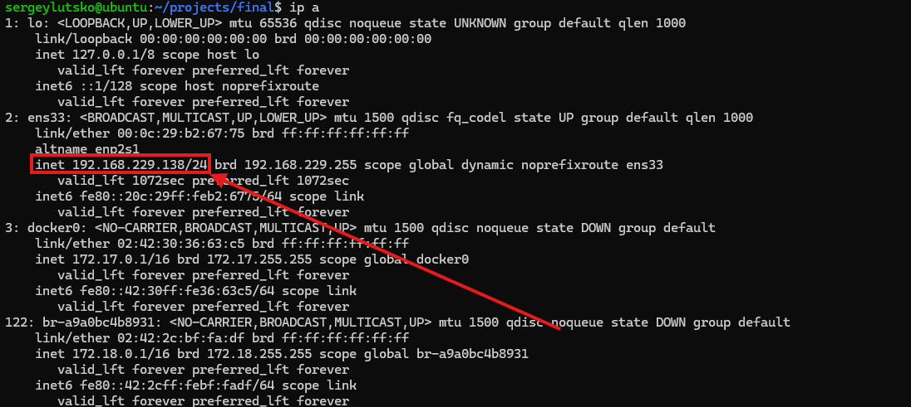
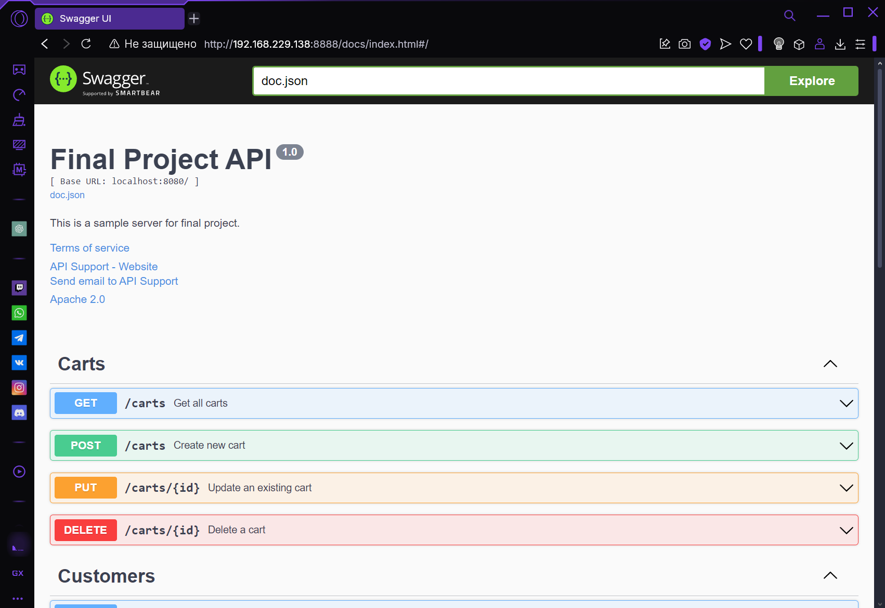
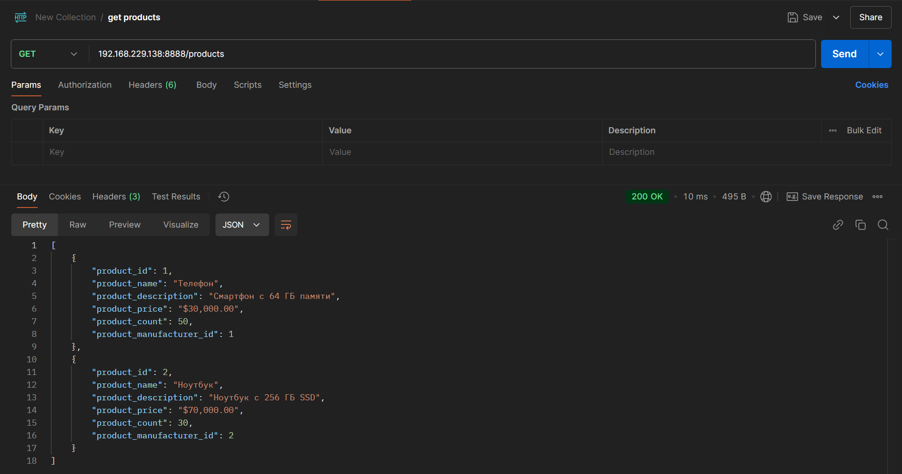
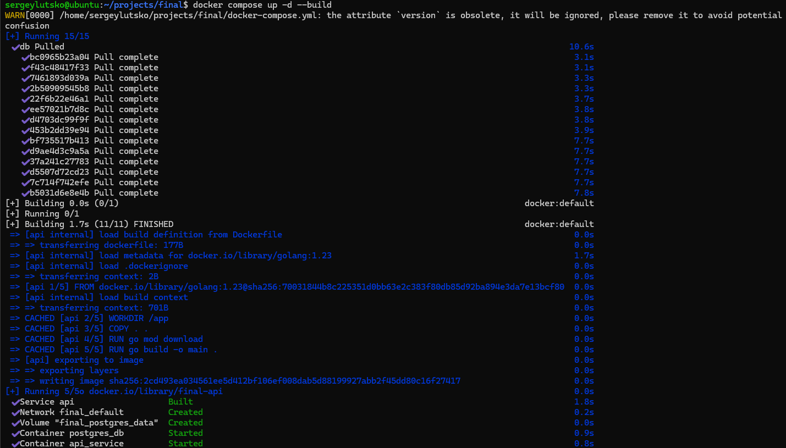
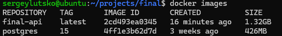
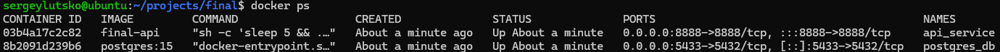

# Финальная практическая работа

Данная практическая работа выполнялась на Ubuntu 24.04.1 LTS

## Подготовка

Установка Golang:
```bash
sudo apt update
wget https://go.dev/dl/go1.23.4.linux-amd64.tar.gz
sudo rm -rf /usr/local/go
sudo tar -C /usr/local -xzf go1.23.4.linux-amd64.tar.gz
echo "export PATH=\$PATH:/usr/local/go/bin" >> ~/.bashrc
source ~/.bashrc
export PATH=$(go env GOPATH)/bin:$PATH
```

Установка и настройка Docker:
```bash
sudo apt update
sudo apt install curl software-properties-common ca-certificates apt-transport-https -y
wget -O- https://download.docker.com/linux/ubuntu/gpg | gpg --dearmor | sudo tee /etc/apt/keyrings/docker.gpg > /dev/null
echo "deb [arch=amd64 signed-by=/etc/apt/keyrings/docker.gpg] https://download.docker.com/linux/ubuntu jammy stable"| sudo tee /etc/apt/sources.list.d/docker.list > /dev/null
sudo apt update
apt-cache policy docker-ce
sudo apt install docker-ce -y
sudo usermod -aG docker $USER
sudo systemctl enable docker
sudo systemctl start docker
sudo chmod 666 /var/run/docker.sock
sudo chown root:docker /var/run/docker.sock
```

Установка и настройка PostgreSQL:
```bash
sudo apt update
sudo apt install -y postgresql
sudo -i -u postgres
createuser --interactive
    # (взаимодействие с диалоговым окном)
psql postgres
ALTER USER postgres WITH PASSWORD 'pass123';
```

Инициализация проекта:
```bash
mkdir final
cd final
mkdir db handlers models
touch main.go db/connection.go
cd handlers
touch cart_handler.go customer_handler.go customer_order_handler.go product_handler.go
cd ../models
touch cart.go customer.go customer_order.go product.go
cd ..
go mod init final
```

Установка зависимостей:
```bash
go get -u github.com/gin-gonic/gin
go get -u github.com/swaggo/files
go get -u github.com/swaggo/gin-swagger
go get -u gorm.io/gorm
go get -u gorm.io/driver/postgres
```

Код проекта доступен по [ссылке](https://github.com/LeetManSup/techSoftwareCreating/tree/main/PracFinal/final).

## Структура проекта
```
sergeylutsko@ubuntu:~$ tree projects/final/
projects/final/
├── api
│   ├── db
│   │   └── connection.go
│   ├── Dockerfile
│   ├── docs
│   │   ├── docs.go
│   │   ├── swagger.json
│   │   └── swagger.yaml
│   ├── go.mod
│   ├── go.sum
│   ├── handlers
│   │   ├── cart_handler.go
│   │   ├── customer_handler.go
│   │   ├── customer_order_handler.go
│   │   └── product_handler.go
│   ├── main.go
│   └── models
│       ├── cart.go
│       ├── customer.go
│       ├── customer_order.go
│       └── product.go
├── docker-compose.yml
└── postgres
    └── init_and_fill.sql

7 directories, 18 files
```

## Dockerfile образа API на Golang
```Dockerfile
FROM golang:1.23

WORKDIR /app

COPY . .

RUN go mod download

RUN go build -o main .

EXPOSE 8888

CMD ["sh", "-c", "sleep 5 && ./main"]
```

## docker-compose.yml
```yaml
version: "3.9"

services:
  api:
    build:
      context: ./api
    container_name: api_service
    ports:
      - "8888:8888"
    environment:
      DB_HOST: db
      DB_USER: postgres
      DB_PASSWORD: pass123
      DB_NAME: final
      DB_PORT: 5432
      DB_SSLMODE: disable
    depends_on:
      - db

  db:
    image: postgres:15
    container_name: postgres_db
    ports:
      - "5433:5432"
    environment:
      POSTGRES_USER: postgres
      POSTGRES_PASSWORD: pass123
      POSTGRES_DB: final
    volumes:
      - postgres_data:/var/lib/postgresql/data
      - ./postgres:/docker-entrypoint-initdb.d

volumes:
  postgres_data:
```
## Подтверждение доступности функционала
Обращаю внимание, что доступ предоставляется не по локальному хосту, а по адресу сервера:



### Доступность документации на Swagger



### Доступность эндпоинтов



## Состояние контейнеров

Сборка и запуск:



Используемые образы:



Запущенные контейнеры:


