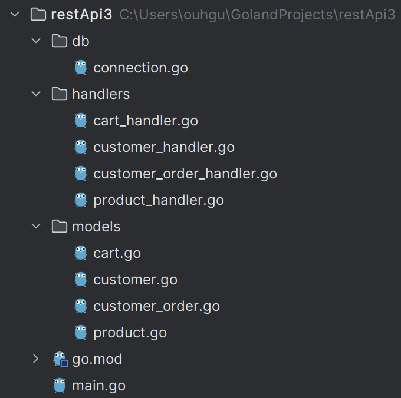
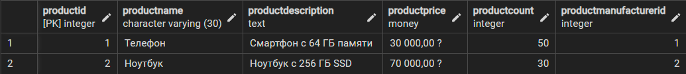
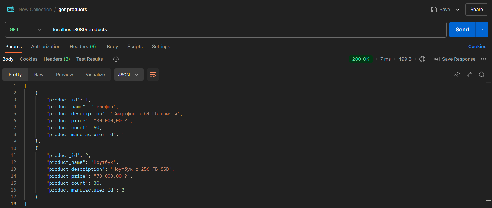
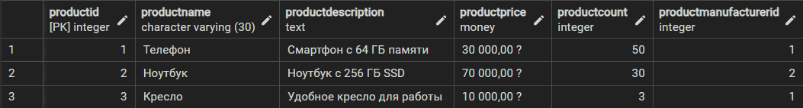
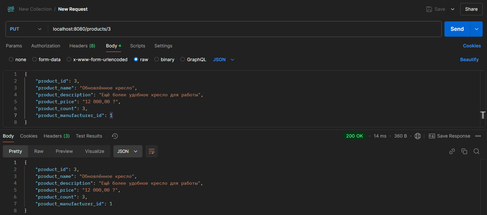
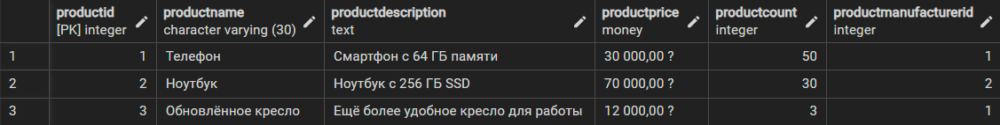
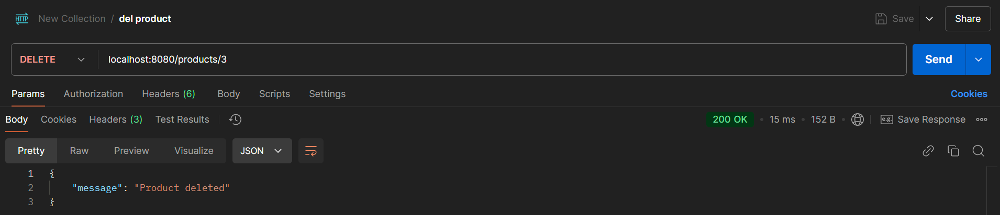

# Практическая работа №10. Интеграция REST API с базой данных (PostgreSQL) на Go

Данная практическая работа выполняется на основе БД, созданной в предыдущей работе.

## Предварительная установка библиотек
```bash
go get -u gorm.io/gorm
```
```bash
go get -u gorm.io/driver/postgres
```
```bash
go get -u github.com/gin-gonic/gin
```

## Структура проекта


## Код проекта
### Подключение к БД (`db/connection.go`)
```go
package db

import (
	"gorm.io/driver/postgres"
	"gorm.io/gorm"
	"log"
)

var DB *gorm.DB

func ConnectDB() {
	dsn := "host=localhost user=postgres password=pass123 dbname=techsoftwarecreating port=5432 sslmode=disable"
	var err error
	DB, err = gorm.Open(postgres.Open(dsn), &gorm.Config{})
	if err != nil {
		log.Fatal("Ошибка подключения к базе данных:", err)
	}
	log.Println("Успешное подключение к базе данных")
}
```

### Модели данных
#### Корзина (`models/cart.go`)
```go
package models

type Cart struct {
	CartID         int    `gorm:"column:cartid;primaryKey" json:"cart_id"`
	CartDateOfLast string `gorm:"column:cartdateoflast;type:timestamp;not null" json:"cart_date_of_last"`
}

func (Cart) TableName() string {
	return "cart"
}
```

#### Покупатель (`models/customer.go`)
```go
package models

type Customer struct {
	CustomerID           int    `gorm:"column:customerid;primaryKey" json:"customer_id"`
	CustomerName         string `gorm:"column:customername;type:varchar(30);not null" json:"customer_name"`
	CustomerSurname      string `gorm:"column:customersurname;type:varchar(30);not null" json:"customer_surname"`
	CustomerPatronymic   string `gorm:"column:customerpatronymic;type:varchar(30);not null" json:"customer_patronymic"`
	CustomerPhone        string `gorm:"column:customerphone;type:varchar(12);not null" json:"customer_phone"`
	CustomerEmail        string `gorm:"column:customeremail;type:varchar(254)" json:"customer_email"`
	CustomerCart         int    `gorm:"column:customercart;not null" json:"customer_cart"`
	CustomerAccountLogin string `gorm:"column:customeraccountlogin;type:varchar(30);not null" json:"customer_account_login"`
}

func (Customer) TableName() string {
	return "customer"
}
```

#### Заказ покупателя (`models/customer_order.go`)
```go
package models

type CustomerOrder struct {
	OrderID        int    `gorm:"column:orderid;primaryKey" json:"order_id"`
	OrderTime      string `gorm:"column:ordertime;type:timestamp;not null" json:"order_time"`
	OrderAddressID int    `gorm:"column:orderaddressid;not null" json:"order_address_id"`
	OrderStatusID  int    `gorm:"column:orderstatusid;not null" json:"order_status_id"`
	OrderSeller    string `gorm:"column:orderseller;type:varchar(30);not null" json:"order_seller"`
	OrderCourier   string `gorm:"column:ordercourier;type:varchar(30);not null" json:"order_courier"`
	AccountLogin   string `gorm:"column:accountlogin;type:varchar(30);not null" json:"account_login"`
}

func (CustomerOrder) TableName() string {
	return "customerorder"
}
```

#### Товар (`models/product.go`)
```go
package models

type Product struct {
	ProductID             int    `gorm:"column:productid;primaryKey" json:"product_id"`
	ProductName           string `gorm:"column:productname;type:varchar(30);not null" json:"product_name"`
	ProductDescription    string `gorm:"column:productdescription;type:text;not null" json:"product_description"`
	ProductPrice          string `gorm:"column:productprice;not null" json:"product_price"`
	ProductCount          int    `gorm:"column:productcount;not null" json:"product_count"`
	ProductManufacturerID int    `gorm:"column:productmanufacturerid;not null" json:"product_manufacturer_id"`
}

func (Product) TableName() string {
	return "product"
}
```

### Обработчики
#### Обработчик данных корзины (`handlers/cart_handler.go`)
```go
package handlers

import (
	"net/http"
	"restApi3/db"
	"restApi3/models"

	"github.com/gin-gonic/gin"
)

func GetCarts(c *gin.Context) {
	var carts []models.Cart
	db.DB.Find(&carts)
	c.JSON(http.StatusOK, carts)
}

func CreateCart(c *gin.Context) {
	var cart models.Cart
	if err := c.ShouldBindJSON(&cart); err != nil {
		c.JSON(http.StatusBadRequest, gin.H{"error": err.Error()})
		return
	}
	db.DB.Create(&cart)
	c.JSON(http.StatusCreated, cart)
}

func UpdateCart(c *gin.Context) {
	id := c.Param("id")
	var cart models.Cart
	if err := db.DB.First(&cart, "CartID = ?", id).Error; err != nil {
		c.JSON(http.StatusNotFound, gin.H{"error": "Cart not found"})
		return
	}
	if err := c.ShouldBindJSON(&cart); err != nil {
		c.JSON(http.StatusBadRequest, gin.H{"error": err.Error()})
		return
	}
	db.DB.Save(&cart)
	c.JSON(http.StatusOK, cart)
}

func DeleteCart(c *gin.Context) {
	id := c.Param("id")
	if err := db.DB.Delete(&models.Cart{}, "CartID = ?", id).Error; err != nil {
		c.JSON(http.StatusNotFound, gin.H{"error": "Cart not found"})
		return
	}
	c.JSON(http.StatusOK, gin.H{"message": "Cart deleted"})
}
```

#### Обработчик данных покупателя (`handlers/customer_handler.go`)
```go
package handlers

import (
	"net/http"
	"restApi3/db"
	"restApi3/models"

	"github.com/gin-gonic/gin"
)

func GetCustomers(c *gin.Context) {
	var customers []models.Customer
	db.DB.Find(&customers)
	c.JSON(http.StatusOK, customers)
}

func CreateCustomer(c *gin.Context) {
	var customer models.Customer
	if err := c.ShouldBindJSON(&customer); err != nil {
		c.JSON(http.StatusBadRequest, gin.H{"error": err.Error()})
		return
	}
	db.DB.Create(&customer)
	c.JSON(http.StatusCreated, customer)
}

func UpdateCustomer(c *gin.Context) {
	id := c.Param("id")
	var customer models.Customer
	if err := db.DB.First(&customer, "CustomerID = ?", id).Error; err != nil {
		c.JSON(http.StatusNotFound, gin.H{"error": "Customer not found"})
		return
	}
	if err := c.ShouldBindJSON(&customer); err != nil {
		c.JSON(http.StatusBadRequest, gin.H{"error": err.Error()})
		return
	}
	db.DB.Save(&customer)
	c.JSON(http.StatusOK, customer)
}

func DeleteCustomer(c *gin.Context) {
	id := c.Param("id")
	if err := db.DB.Delete(&models.Customer{}, "CustomerID = ?", id).Error; err != nil {
		c.JSON(http.StatusNotFound, gin.H{"error": "Customer not found"})
		return
	}
	c.JSON(http.StatusOK, gin.H{"message": "Customer deleted"})
}
```

#### Обработчик данных заказа покупателя (`handlers/customer_order_handler.go`)
```go
package handlers

import (
	"net/http"
	"restApi3/db"
	"restApi3/models"

	"github.com/gin-gonic/gin"
)

func GetOrders(c *gin.Context) {
	var orders []models.CustomerOrder
	db.DB.Find(&orders)
	c.JSON(http.StatusOK, orders)
}

func CreateOrder(c *gin.Context) {
	var order models.CustomerOrder
	if err := c.ShouldBindJSON(&order); err != nil {
		c.JSON(http.StatusBadRequest, gin.H{"error": err.Error()})
		return
	}
	db.DB.Create(&order)
	c.JSON(http.StatusCreated, order)
}

func UpdateOrder(c *gin.Context) {
	id := c.Param("id")
	var order models.CustomerOrder
	if err := db.DB.First(&order, "OrderID = ?", id).Error; err != nil {
		c.JSON(http.StatusNotFound, gin.H{"error": "Order not found"})
		return
	}
	if err := c.ShouldBindJSON(&order); err != nil {
		c.JSON(http.StatusBadRequest, gin.H{"error": err.Error()})
		return
	}
	db.DB.Save(&order)
	c.JSON(http.StatusOK, order)
}

func DeleteOrder(c *gin.Context) {
	id := c.Param("id")
	if err := db.DB.Delete(&models.CustomerOrder{}, "OrderID = ?", id).Error; err != nil {
		c.JSON(http.StatusNotFound, gin.H{"error": "Order not found"})
		return
	}
	c.JSON(http.StatusOK, gin.H{"message": "Order deleted"})
}
```

#### Обработчик данных товара (`handlers/product_handler.go`)
```go
package handlers

import (
	"net/http"
	"restApi3/db"
	"restApi3/models"

	"github.com/gin-gonic/gin"
)

func GetProducts(c *gin.Context) {
	var products []models.Product
	db.DB.Find(&products)
	c.JSON(http.StatusOK, products)
}

func CreateProduct(c *gin.Context) {
	var product models.Product
	if err := c.ShouldBindJSON(&product); err != nil {
		c.JSON(http.StatusBadRequest, gin.H{"error": err.Error()})
		return
	}
	db.DB.Create(&product)
	c.JSON(http.StatusCreated, product)
}

func UpdateProduct(c *gin.Context) {
	id := c.Param("id")
	var product models.Product
	if err := db.DB.First(&product, "ProductID = ?", id).Error; err != nil {
		c.JSON(http.StatusNotFound, gin.H{"error": "Product not found"})
		return
	}
	if err := c.ShouldBindJSON(&product); err != nil {
		c.JSON(http.StatusBadRequest, gin.H{"error": err.Error()})
		return
	}
	db.DB.Save(&product)
	c.JSON(http.StatusOK, product)
}

func DeleteProduct(c *gin.Context) {
	id := c.Param("id")
	if err := db.DB.Delete(&models.Product{}, "ProductID = ?", id).Error; err != nil {
		c.JSON(http.StatusNotFound, gin.H{"error": "Product not found"})
		return
	}
	c.JSON(http.StatusOK, gin.H{"message": "Product deleted"})
}
```

### Точка входа в программу (`main.go`)
```go
package main

import (
	"restApi3/db"
	"restApi3/handlers"

	"github.com/gin-gonic/gin"
)

func main() {
	db.ConnectDB()

	router := gin.Default()

	// Продукты
	router.GET("/products", handlers.GetProducts)
	router.POST("/products", handlers.CreateProduct)
	router.PUT("/products/:id", handlers.UpdateProduct)
	router.DELETE("/products/:id", handlers.DeleteProduct)

	// Клиенты
	router.GET("/customers", handlers.GetCustomers)
	router.POST("/customers", handlers.CreateCustomer)
	router.PUT("/customers/:id", handlers.UpdateCustomer)
	router.DELETE("/customers/:id", handlers.DeleteCustomer)

	// Корзины
	router.GET("/carts", handlers.GetCarts)
	router.POST("/carts", handlers.CreateCart)
	router.PUT("/carts/:id", handlers.UpdateCart)
	router.DELETE("/carts/:id", handlers.DeleteCart)

	// Заказы
	router.GET("/orders", handlers.GetOrders)
	router.POST("/orders", handlers.CreateOrder)
	router.PUT("/orders/:id", handlers.UpdateOrder)
	router.DELETE("/orders/:id", handlers.DeleteOrder)

	router.Run(":8080")
}
```

## Проверка работоспособности (на примере сущности *Product*)

### Получение списка товаров
Состояние таблицы `product` в БД:


Запрос:
- Метод `GET`
- URL: `localhost:8080/products`

Результат:


### Добавление нового товара
Состояние таблицы `product` в БД до добавления:


Запрос:
- Метод `POST`
- URL: `localhost:8080/products`
- Body (JSON):
    ```json
    {
        "product_id": 3,
        "product_name": "Кресло",
        "product_description": "Удобное кресло для работы",
        "product_price": "10 000,00 ?",
        "product_count": 3,
        "product_manufacturer_id": 1
    }
    ```

Результат:


Состояние таблицы `product` в БД после добавления:


### Обновление существующего товара
Состояние таблицы `product` в БД до обновления:


Запрос:
- Метод `PUT`
- URL: `localhost:8080/products/3`
- Body (JSON):
    ```json
    {
        "product_id": 3,
        "product_name": "Обновлённое кресло",
        "product_description": "Ещё более удобное кресло для работы",
        "product_price": "12 000,00 ?",
        "product_count": 3,
        "product_manufacturer_id": 1
    }
    ```

Результат:


Состояние таблицы `product` в БД после обновления:


### Удаление существующего товара
Состояние таблицы `product` в БД до удаления:


Запрос:
- Метод `DELETE`
- URL: `localhost:8080/products/3`

Результат:


Состояние таблицы `product` в БД после удаления:
