# Практическая работа №6. Задачи по языку программирования Go

### Задача 1. Проверка на простоту
Напишите функцию, которая проверяет, является ли переданное число простым. Ваша программа должна использовать циклы для проверки делителей, и если число не является простым, выводить первый найденный делитель.

```go
package main

import (
	"fmt"
	"math"
	"os"
)

func isPrime(number int) int {
	for i := 2; i <= int(math.Sqrt(float64(number))); i++ {
		if number%i == 0 {
			return i
		}
	}
	return 0
}

func main() {
	var number int

	fmt.Print("Введите число: ")
	fmt.Fscan(os.Stdin, &number)

	result := isPrime(number)

	if result == 0 {
		fmt.Println("Число простое")
	} else {
		fmt.Println("Первый найденный делитель: ", result)
	}
}
```
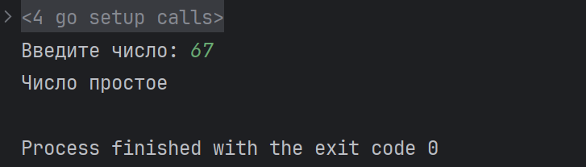
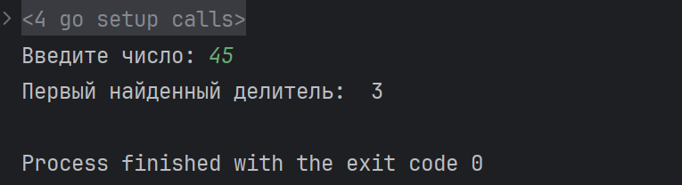

---

### Задача 2. Наибольший общий делитель (НОД)
Напишите программу для нахождения наибольшего общего делителя (НОД) двух чисел с использованием алгоритма Евклида. Используйте цикл `for` для вычислений.

```go
package main

import (
	"fmt"
	"os"
)

func minMax(number1, number2 int) (int, int) {
	return min(number1, number2), max(number1, number2)
}

func leastCommonDivisor(number1, number2 int) int {
	minNumber, maxNumber := minMax(number1, number2)

	for maxNumber != minNumber {
		maxNumber -= minNumber
		minNumber, maxNumber = minMax(minNumber, maxNumber)
	}

	return maxNumber
}

func main() {
	var number1, number2 int
	fmt.Println("Введите 2 числа:")
	fmt.Fscan(os.Stdin, &number1, &number2)

	fmt.Printf("НОД для чисел %d и %d: %d", number1, number2, leastCommonDivisor(number1, number2))
}
```

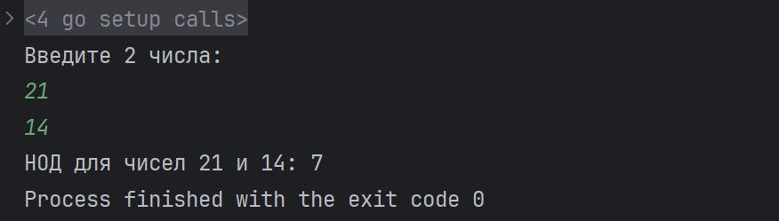

---

### Задача 3. Сортировка пузырьком
Реализуйте сортировку пузырьком для списка целых чисел. Программа должна выполнять сортировку на месте и выводить каждый шаг изменения массива.

```go
package main

import "fmt"

func bubbleSort(mass []int) []int {
	counter := 0
	for i := 0; i < len(mass)-1; i++ {
		flag := false
		for j := 0; j < len(mass)-i-1; j++ {
			if mass[j] > mass[j+1] {
				flag = true
				mass[j], mass[j+1] = mass[j+1], mass[j]
			}
			counter++
			fmt.Println(counter, ":", mass)
		}
		if !flag {
			break
		}
	}
	return mass
}

func main() {
	var size, value int
	var massive []int

	fmt.Println("Введите количество элементов массива: ")
	fmt.Scan(&size)

	for i := 0; i < size; i++ {
		fmt.Scan(&value)
		massive = append(massive, value)
	}

	massive = bubbleSort(massive)
}
```
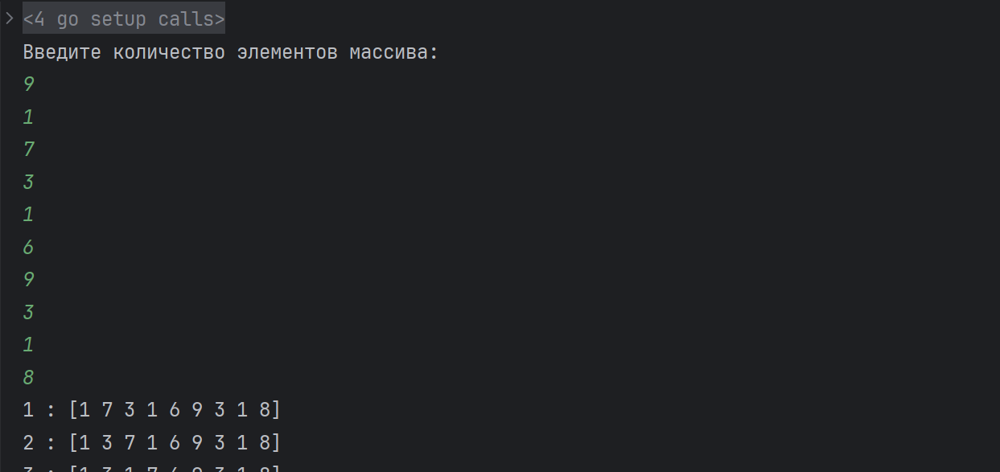
Консольный вывод (этапы сортировки):
```
1 : [1 7 3 1 6 9 3 1 8]
2 : [1 3 7 1 6 9 3 1 8]
3 : [1 3 1 7 6 9 3 1 8]
4 : [1 3 1 6 7 9 3 1 8]
5 : [1 3 1 6 7 9 3 1 8]
6 : [1 3 1 6 7 3 9 1 8]
7 : [1 3 1 6 7 3 1 9 8]
8 : [1 3 1 6 7 3 1 8 9]
9 : [1 3 1 6 7 3 1 8 9]
10 : [1 1 3 6 7 3 1 8 9]
11 : [1 1 3 6 7 3 1 8 9]
12 : [1 1 3 6 7 3 1 8 9]
13 : [1 1 3 6 3 7 1 8 9]
14 : [1 1 3 6 3 1 7 8 9]
15 : [1 1 3 6 3 1 7 8 9]
16 : [1 1 3 6 3 1 7 8 9]
17 : [1 1 3 6 3 1 7 8 9]
18 : [1 1 3 6 3 1 7 8 9]
19 : [1 1 3 3 6 1 7 8 9]
20 : [1 1 3 3 1 6 7 8 9]
21 : [1 1 3 3 1 6 7 8 9]
22 : [1 1 3 3 1 6 7 8 9]
23 : [1 1 3 3 1 6 7 8 9]
24 : [1 1 3 3 1 6 7 8 9]
25 : [1 1 3 1 3 6 7 8 9]
26 : [1 1 3 1 3 6 7 8 9]
27 : [1 1 3 1 3 6 7 8 9]
28 : [1 1 3 1 3 6 7 8 9]
29 : [1 1 1 3 3 6 7 8 9]
30 : [1 1 1 3 3 6 7 8 9]
31 : [1 1 1 3 3 6 7 8 9]
32 : [1 1 1 3 3 6 7 8 9]
33 : [1 1 1 3 3 6 7 8 9]
```

---

### Задача 4. Таблица умножения в формате матрицы
Напишите программу, которая выводит таблицу умножения в формате матрицы 10x10. Используйте циклы для генерации строк и столбцов.
```go
package main

import "fmt"

func printMultiplicationTable() {
	var result [10][10]int

	for rowIndex, row := range result {
		for colIndex := range row {
			result[rowIndex][colIndex] = (rowIndex + 1) * (colIndex + 1)
		}
		fmt.Println(result[rowIndex])
	}
}

func main() {
	printMultiplicationTable()
}
```
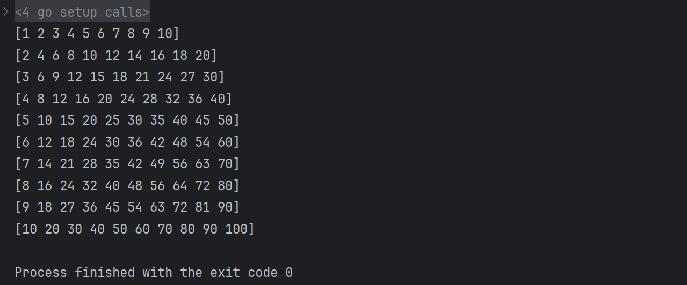

---

### Задача 5. Фибоначчи с меморизацией
Напишите функцию для вычисления числа Фибоначчи с использованием мемоизации (сохранение ранее вычисленных результатов). Программа должна использовать рекурсию и условные операторы.
```go
package main

import "fmt"

var fibonacciNumbers map[int]int = map[int]int{0: 0, 1: 1}

func memFibonacci(n int) int {
	if val, ok := fibonacciNumbers[n-1]; ok {
		return val
	}
	fibonacciNumbers[n-1] = memFibonacci(n-1) + memFibonacci(n-2)

	return fibonacciNumbers[n-2] + fibonacciNumbers[n-3]
}

func main() {
	for i := 1; i <= 10; i++ {
		fmt.Println(memFibonacci(i))
	}
}
```
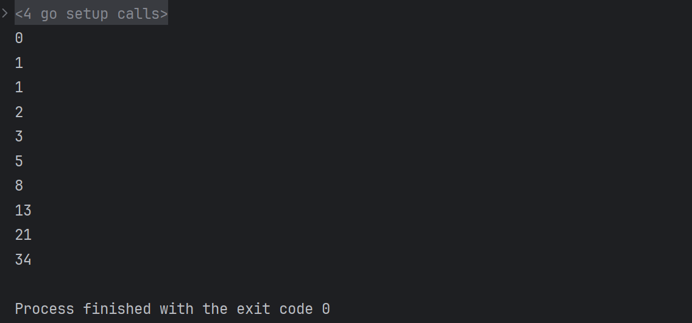

---

### Задача 6. Обратные числа
Напишите программу, которая принимает целое число и выводит его в обратном порядке. Например, для числа 12345 программа должна вывести 54321. Используйте цикл для обработки цифр числа.
```go
package main

import "fmt"

func reverseNumber(number int) int {
	var result int

	for number > 0 {
		result *= 10
		result += number % 10
		number /= 10
	}

	return result
}

func main() {
	fmt.Println(reverseNumber(12345))
}
```
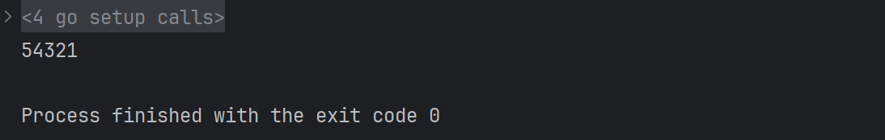

---

### Задача 7. Треугольник Паскаля
Напишите программу, которая выводит треугольник Паскаля до заданного уровня. Для этого используйте цикл и массивы для хранения предыдущих значений строки треугольника.
```go
package main

import "fmt"

func getPascalTriangle(rows int) [][]int {
	firstRow := []int{1}
	if rows == 1 {
		return [][]int{firstRow}
	}

	secondRow := []int{1, 1}
	if rows == 2 {
		return [][]int{firstRow, secondRow}
	}

	output := [][]int{firstRow, secondRow}
	for i := 2; i < rows; i++ {
		tmp := make([]int, i+1)
		lastRow := output[i-1]

		tmp[0], tmp[i] = 1, 1
		for j := 1; j < i; j++ {
			tmp[j] = lastRow[j-1] + lastRow[j]
		}

		output = append(output, tmp)
	}

	return output
}

func main() {
	triangle := getPascalTriangle(10)

	for _, value := range triangle {
		fmt.Println(value)
	}
}
```
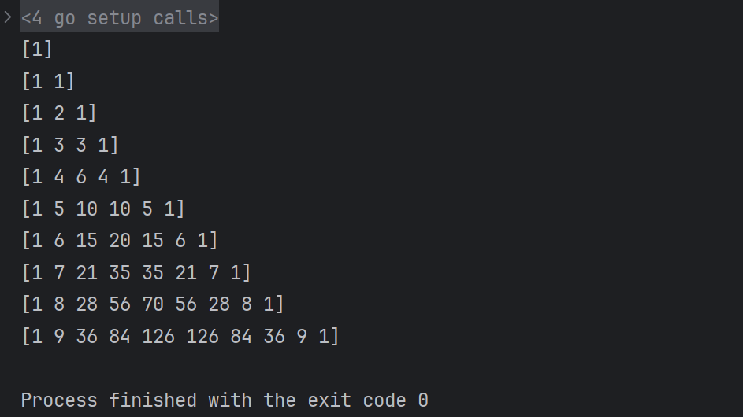

---

### Задача 8. Число палиндром
Напишите программу, которая проверяет, является ли число палиндромом (одинаково читается слева направо и справа налево). Не используйте строки для решения этой задачи — работайте только с числами.
```go
package main

import (
	"fmt"
)

func isPalindrome(number int) bool {
	reverse := 0
	tmp := number

	for tmp > 0 {
		reverse = reverse*10 + tmp%10
		tmp /= 10
	}

	if reverse == number {
		return true
	} else {
		return false
	}
}

func main() {
	var number int
	fmt.Print("Введите число: ")
	fmt.Scan(&number)
	fmt.Println(isPalindrome(number))
}
```

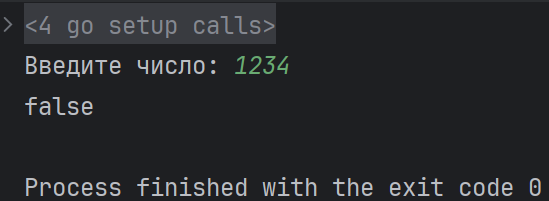

---

### Задача 9. Нахождение максимума и минимума в массиве
Напишите функцию, которая принимает массив целых чисел и возвращает одновременно максимальный и минимальный элемент с использованием одного прохода по массиву.
```go
package main

import (
	"fmt"
)

func arrayMinMax(array []int) (int, int) {
	minVal, maxVal := array[0], array[0]

	for _, value := range array {
		if value < minVal {
			minVal = value
		} else if value > maxVal {
			maxVal = value
		}
	}

	return minVal, maxVal
}

func main() {
	var size int
	var array []int

	fmt.Print("Введите количество элементов массива: ")
	fmt.Scan(&size)

	fmt.Print("Введите элементы массива по одному: ")
	for i := 0; i < size; i++ {
		var tmp int
		fmt.Scan(&tmp)
		array = append(array, tmp)
	}

	fmt.Println(arrayMinMax(array))
}
```
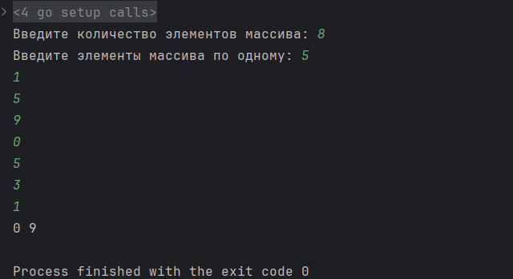

---

### Задача 10. Игра "Угадай число"
Напишите программу, которая загадывает случайное число от 1 до 100, а пользователь пытается его угадать. Программа должна давать подсказки "больше" или "меньше" после каждой попытки. Реализуйте ограничение на количество попыток.
```go
package main

import (
	"fmt"
	"math/rand"
)

func generateNumber(min, max int) int {
	return rand.Intn(max+1-min) + min
}

func main() {
	var minNum, maxNum, attempts, number, answer int

	fmt.Print("Введите края диапазона угадывания и количество попыток (3 числа):")
	fmt.Scan(&minNum, &maxNum, &attempts)

	number = generateNumber(minNum, maxNum)

	fmt.Println("Игра началась!")

	for attempts > 0 {
		fmt.Scan(&answer)

		if answer == number {
			fmt.Print("Вы угадали!")
			break
		} else {
			attempts--
			fmt.Printf("Неверно! Осталось попыток: %d\n", attempts)
		}
	}

	fmt.Printf("Было загадано число: %d", number)
}
```
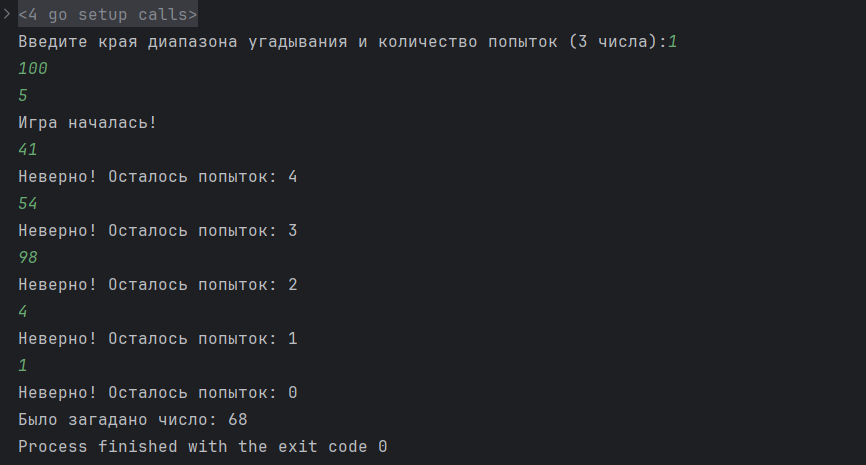

---

### Задача 11. Числа Армстронга
Напишите программу, которая проверяет, является ли число числом Армстронга (число равно сумме своих цифр, возведённых в степень, равную количеству цифр числа). Например, 153 = 1³ + 5³ + 3³.
```go
package main

import "fmt"

func pow(x int, y int) int {
	result := 1
	for y > 0 {
		result *= x
		y--
	}
	return result
}

func isArmstrong(x int) bool {
	var digits []int
	tmp := x
	sum := 0

	for tmp > 0 {
		digits = append(digits, tmp%10)
		tmp /= 10
	}

	for _, d := range digits {
		sum += pow(d, len(digits))
	}

	if sum == x {
		return true
	} else {
		return false
	}
}

func main() {
	var number int

	fmt.Print("Введите число: ")
	fmt.Scan(&number)

	fmt.Print(isArmstrong(number))
}
```
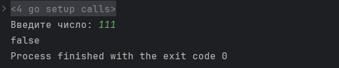
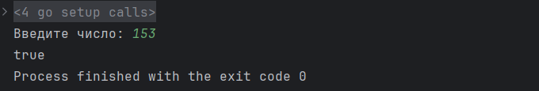

---

### Задача 12. Подсчет слов в строке
Напишите программу, которая принимает строку и выводит количество уникальных слов в ней. Используйте `map` для хранения слов и их количества.
```go
package main

import (
	"bufio"
	"fmt"
	"os"
	"strings"
)

func countUniqueWords(s string) int {
	words := strings.Fields(strings.ToLower(s))
	wordCount := make(map[string]int)

	for _, word := range words {
		wordCount[word]++
	}

	return len(wordCount)
}

func main() {
	scanner := bufio.NewScanner(os.Stdin)

	fmt.Print("Введите строку: ")
	scanner.Scan()

	fmt.Print(countUniqueWords(scanner.Text()))
}
```
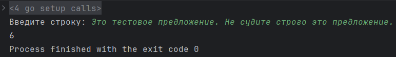

---

### Задача 13. Игра "Жизнь" (Conway's Game of Life)
Реализуйте клеточный автомат "Жизнь" Конвея для двухмерного массива. Каждая клетка может быть либо живой, либо мертвой. На каждом шаге состояния клеток изменяются по следующим правилам:
   - Живая клетка с двумя или тремя живыми соседями остаётся живой, иначе умирает.
   - Мёртвая клетка с тремя живыми соседями оживает.
   Используйте циклы для обработки клеток.
```go
package main

import (
	"fmt"
	"math/rand"
	"time"
)

const (
	columns = 10
	rows    = 10
)

func initGrid() [][]bool {
	grid := make([][]bool, rows)

	for i := range grid {
		grid[i] = make([]bool, columns)

		for j := range grid[i] {
			grid[i][j] = rand.Intn(2) == 1
		}
	}

	return grid
}

func printGrid(grid [][]bool) {
	for i := range grid {
		for j := range grid[i] {
			if grid[i][j] {
				fmt.Print("# ")
			} else {
				fmt.Print(". ")
			}
		}
		fmt.Println()
	}
	fmt.Println()
}

func countNeighbours(grid [][]bool, i, j int) int {
	count := 0
	for x := -1; x <= 1; x++ {
		for y := -1; y <= 1; y++ {
			if x == 0 && y == 0 {
				continue
			}
			ni, nj := i+x, j+y
			if ni >= 0 && ni < rows && nj >= 0 && nj < columns && grid[ni][nj] {
				count++
			}
		}
	}
	return count
}

func nextGen(grid [][]bool) [][]bool {
	newGrid := make([][]bool, rows)

	for i := range newGrid {
		newGrid[i] = make([]bool, columns)
		for j := range newGrid[i] {
			neighbors := countNeighbours(grid, i, j)
			if grid[i][j] {
				newGrid[i][j] = neighbors == 2 || neighbors == 3
			} else {
				newGrid[i][j] = neighbors == 3
			}
		}
	}

	return newGrid
}

func startGame(generations int) {
	grid := initGrid()

	fmt.Println("Начальное состояние (поколение 0): ")
	printGrid(grid)

	for i := 1; i <= generations; i++ {
		grid = nextGen(grid)

		fmt.Printf("Поколение %d:\n", i)
		printGrid(grid)

		time.Sleep(300 * time.Millisecond)
	}
}

func main() {
	var generations int

	fmt.Print("Введите количество поколений: ")
	fmt.Scan(&generations)

	startGame(generations)
}
```

Консольный вывод для 5 поколений:
```plaintext
Введите количество поколений: 5
Начальное состояние (поколение 0): 
. # # # . # # . # # 
# # . . # # . . # . 
. . # # . . . # # . 
# . . . # . # # # . 
. . # . # # . # # . 
# . # . . . . # . . 
# . . . # # # # # . 
# . . . # # . # . . 
. # # . # # . . # . 
# # . # . # # # # . 

Поколение 1:
# # # # . # # # # # 
# . . . . # . . . . 
# . # # . . . . . # 
. # # . # . . . . # 
. . . . # # . . . . 
. . . . . . . . . . 
# . . # # . . . # . 
# . . . . . . . . . 
. . # . . . . . # . 
# # . # . # # # # . 

Поколение 2:
# # # . # # # # # . 
# . . . . # . # . # 
# . # # # . . . . . 
. # # . # # . . . . 
. . . # # # . . . . 
. . . # . # . . . . 
. . . . . . . . . . 
. # . # . . . . . . 
# . # . . . # . # . 
. # # . . . # # # . 

Поколение 3:
# # . . # # . # # . 
# . . . . . . # . . 
# . # . . . # . . . 
. # . . . . . . . . 
. . . . . . # . . . 
. . . # . # . . . . 
. . # . # . . . . . 
. # # . . . . . . . 
# . . # . . # . # . 
. # # . . . # . # . 

Поколение 4:
# # . . . . # # # . 
# . . . . # . # # . 
# . . . . . . . . . 
. # . . . . . . . . 
. . . . . . . . . . 
. . . # # # . . . . 
. # # . # . . . . . 
. # # . . . . . . . 
# . . # . . . . . . 
. # # . . . . . . . 

Поколение 5:
# # . . . . # . # . 
# . . . . . . . # . 
# # . . . . . . . . 
. . . . . . . . . . 
. . . . # . . . . . 
. . # # # # . . . . 
. # . . # # . . . . 
# . . . . . . . . . 
# . . # . . . . . . 
. # # . . . . . . . 


Process finished with the exit code 0
```

---

### Задача 14. Цифровой корень числа
Напишите программу, которая вычисляет цифровой корень числа. Цифровой корень — это рекурсивная сумма цифр числа, пока не останется только одна цифра. Например, цифровой корень числа 9875 равен 2, потому что 9+8+7+5=29 → 2+9=11 → 1+1=2.
```go
package main

import "fmt"

func numericRoot(number int) int {
	if number < 10 {
		return number
	} else {
		sum := 0

		for number > 0 {
			sum += number % 10
			number /= 10
		}
		
		return numericRoot(sum)
	}
}

func main() {
	var number int

	fmt.Print("Начальное число: ")
	fmt.Scan(&number)

	fmt.Println(numericRoot(number))
}
```
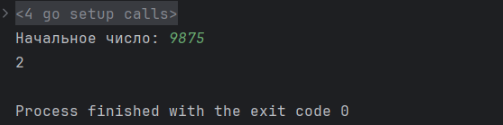

---

### Задача 15. Римские цифры
Напишите функцию, которая преобразует арабское число (например, 1994) в римское (например, "MCMXCIV"). Программа должна использовать циклы и условные операторы для создания римской записи.
```go
package main

import (
	"fmt"
	"sort"
)

func convertToRoman(number int) string {
	var signs = map[int]string{
		1:    "I",
		4:    "IV",
		5:    "V",
		9:    "IX",
		10:   "X",
		40:   "XL",
		50:   "L",
		90:   "XC",
		100:  "C",
		400:  "CD",
		500:  "D",
		900:  "CM",
		1000: "M",
	}
	var result string

	keys := make([]int, 0, len(signs))

	for k := range signs {
		keys = append(keys, k)
	}

	sort.Sort(sort.Reverse(sort.IntSlice(keys)))

	for number > 0 {
		for _, k := range keys {
			if k <= number {
				result += signs[k]
				number -= k
				break
			}
		}
	}

	return result
}

func main() {
	var number int

	fmt.Print("Введите число: ")
	fmt.Scan(&number)

	fmt.Println(convertToRoman(number))
}
```
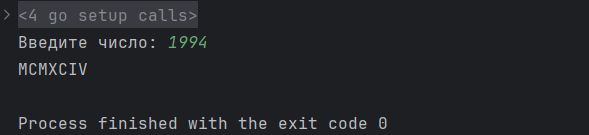
