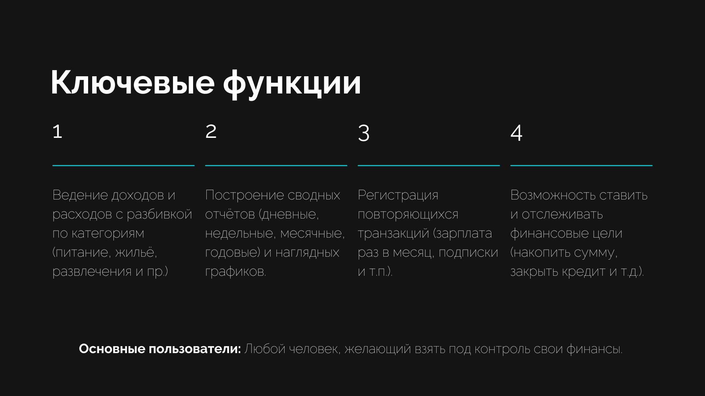
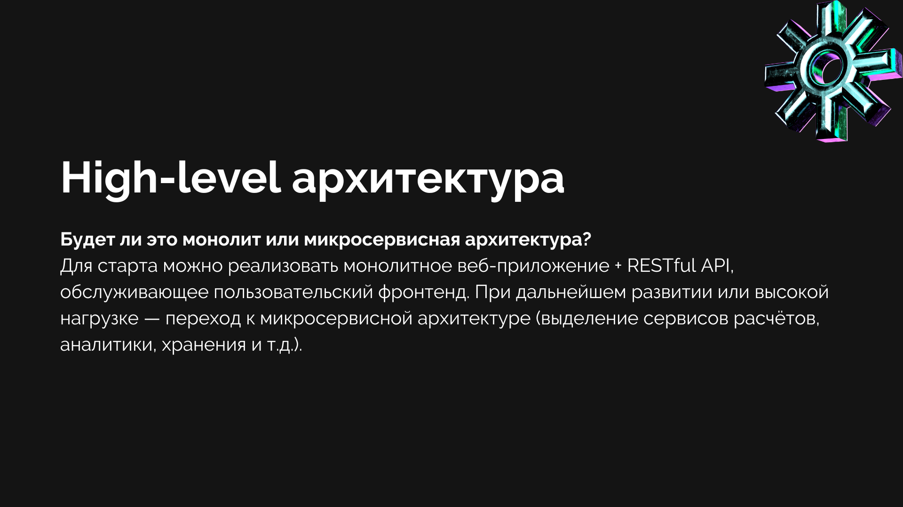
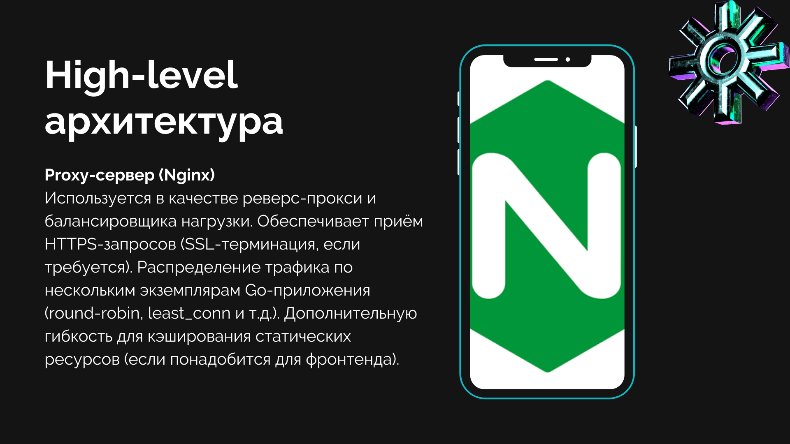
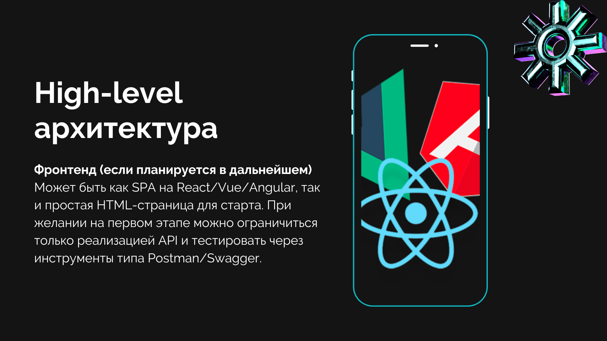
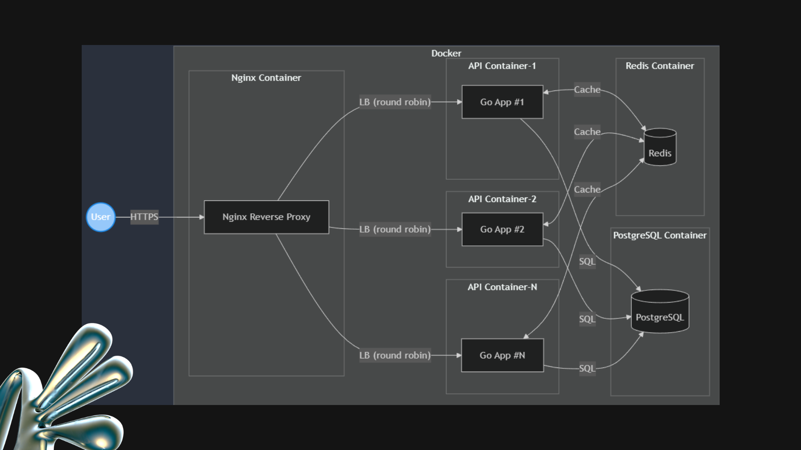
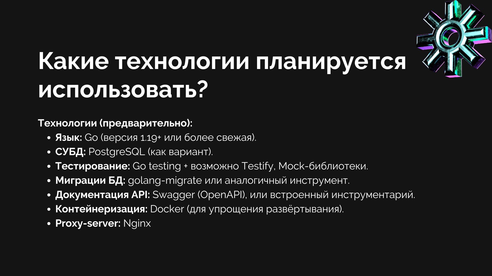

# Практическая работа 1: "Выбор и проработка идеи проекта"

## 1. Разделиться на команды или работать индивидуально
Проект реализовывается в индивидуальном порядке.

## 2. Выбрать идею проекта
**Идея проекта:** Трекер личных финансов.

## 3. Описать концепцию проекта
**Описание идеи:** Проект представляет собой веб-сервис / API, позволяющий пользователю учитывать все личные доходы и расходы, анализировать финансовые потоки, ставить цели (накопления, погашение кредита и т.д.) и отслеживать прогресс.

**Главная цель:** предоставить удобный инструмент планирования и
контроля личного бюджета.

**Проблемы, которые решает проект:**
- Отсутствие понятной визуализации доходов и расходов (часто люди теряют понимание, куда уходят деньги).
- Сложности при попытках вести бюджет вручную (например, Excel-таблицы, блокноты, разрозненные записи).
- Недостаточная аналитика и отсутствие «умного» распределения средств (классификация по категориям, настройка лимитов и т.д.).

**Ключевые функции:**
- Ведение доходов и расходов с разбивкой по категориям (питание, жильё, развлечения и пр.).
- Построение сводных отчётов (дневные, недельные, месячные, годовые) и наглядных графиков.
- Регистрация повторяющихся транзакций (зарплата раз в месяц, подписки и т.п.).
- Возможность ставить и отслеживать финансовые цели (накопить сумму, закрыть кредит и т.д.).

**Основные пользователи:**
Любой человек, желающий взять под контроль свои финансы. Возможное расширение целевой аудитории – мелкие предприниматели или фрилансеры (учёт доходов из разных источников, упрощённая бухгалтерия).

## 4. Разработать high-level архитектуру
**Какие сервисы будут использоваться?**
- **Серверное приложение.** Написано на Golang (основа проекта). Реализует логику работы с финансами (CRUD операций по транзакциям, расчёты по категориям, отчёты, уведомления и т.д.).
- **База данных.** Реляционная СУБД (например, PostgreSQL или MySQL), так как она хорошо подходит для финансовых транзакций и обеспечивает надёжность, транзакционность, удобный язык запросов. Дополнительно, если будет большой упор на аналитику и отчёты, можно рассмотреть хранилище (или отдельную таблицу) для агрегированных данных.
- **Кэш (по необходимости).** Redis для быстрой выборки часто запрашиваемых данных (например, сводная информация по дням или основная статистика).
- **Proxy-сервер (Nginx).** Используется в качестве реверс-прокси и балансировщика нагрузки. Обеспечивает приём HTTPS-запросов (SSL-терминация, если требуется). Распределение трафика по нескольким экземплярам Go-приложения (round-robin, least_conn и т.д.). Дополнительную гибкость для кэширования статических ресурсов (если понадобится для фронтенда).
- **Фронтенд (если планируется в дальнейшем).** Может быть как SPA на React/Vue/Angular, так и простая HTML-страница для старта. При желании на первом этапе можно ограничиться только реализацией API и тестировать через инструменты типа Postman/Swagger.

**Будет ли это монолит или микросервисная архитектура?**
Для старта можно реализовать монолитное веб-приложение + RESTful (или gRPC) API, обслуживающее пользовательский фронтенд. При дальнейшем развитии или высокой нагрузке — переход к микросервисной архитектуре (выделение сервисов расчётов, аналитики, хранения и т.д.).

**Какие технологии планируется использовать (БД, кеш, брокеры сообщений и т. д.)?**

**Технологии (предварительно):**
- **Язык**: Go (версия 1.19+ или более свежая).
- **СУБД**: PostgreSQL (как вариант).
- **Тестирование**: Go testing + возможно Testify, Mock-библиотеки.
- **Миграции БД**: golang-migrate или аналогичный инструмент.
- **Документация API**: Swagger (OpenAPI), или встроенный инструментарий.
- **Контейнеризация**: Docker (для упрощения развёртывания).

## Презентация

