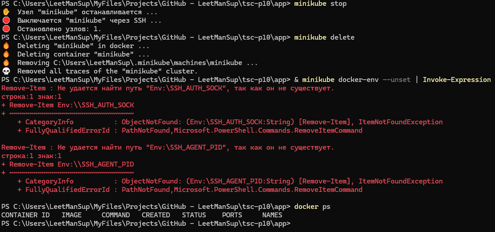

# Практическое задание 10: Развертывание и DevOps

## 0. Подготовка
Установка Chocolatey:
```shell
Set-ExecutionPolicy Bypass -Scope Process -Force; `
[System.Net.ServicePointManager]::SecurityProtocol = `
[System.Net.ServicePointManager]::SecurityProtocol -bor 3072; `
iex ((New-Object System.Net.WebClient).DownloadString('https://community.chocolatey.org/install.ps1'))
```

Установка инструментария:
```shell
choco install kubernetes-cli -y
choco install minikube -y
```

Запуск Minikube:
```shell
minikube start --driver=docker
```

Проверка:
```shell
kubectl get nodes
```


## 1. Создание проекта и контейнеризация

Код проекта доступен [по ссылке](https://github.com/LeetManSup/tsc-p10/).

Структура проекта:


`main.go`:
```go
package main

import (
	"fmt"
	"net/http"
)

func handler(w http.ResponseWriter, r *http.Request) {
	fmt.Fprintln(w, "Hello from Docker and Kubernetes!")
}

func main() {
	http.HandleFunc("/", handler)
	fmt.Println("Starting server on :8080...")
	http.ListenAndServe(":8080", nil)
}
```

`Dockerfile`:
```Dockerfile
# Сборочный этап
FROM golang:1.20-alpine AS builder

WORKDIR /app
COPY go.mod go.sum ./
RUN go mod download

COPY . .
RUN go build -o app .

# Минимальный образ
FROM alpine:latest
WORKDIR /root/
COPY --from=builder /app/app .
EXPOSE 8080
CMD ["./app"]
```

Сборка образа и запуск контейнера:
```shell
cd app
docker build -t my-go-app .
docker run -p 8080:8080 my-go-app
```


## 2. CI/CD через GITHUB ACTIONS

Создаём файл `go.yml` по следующему пути:


`go.yml`:
```yml
name: Go CI/CD

on:
  push:
    branches: [main]

jobs:
  build-and-test:
    runs-on: ubuntu-latest
    steps:
      - uses: actions/checkout@v3

      - name: Set up Go
        uses: actions/setup-go@v4
        with:
          go-version: 1.24

      - name: Install dependencies
        run: go mod tidy
        working-directory: app

      - name: Run tests
        run: go test ./...
        working-directory: app

      - name: Build
        run: go build -o app .
        working-directory: app
```

После пуша на гитхаб:


## 3. Развёртывание в Kubernetes

Создаём `deployment.yaml` и `service.yaml`:


`deployment.yaml`:
```yaml
apiVersion: apps/v1
kind: Deployment
metadata:
  name: go-app
spec:
  replicas: 2
  selector:
    matchLabels:
      app: go-app
  template:
    metadata:
      labels:
        app: go-app
    spec:
      containers:
        - name: go-app
          image: my-go-app
          imagePullPolicy: Never
          ports:
            - containerPort: 8080
```


`service.yaml`:
```yaml
apiVersion: v1
kind: Service
metadata:
  name: go-app-service
spec:
  selector:
    app: go-app
  ports:
    - protocol: TCP
      port: 80
      targetPort: 8080
  type: NodePort
```

Применение манифестов:
```shell
kubectl apply -f app/deployment.yaml
kubectl apply -f app/service.yaml
kubectl get pods
kubectl get svc
```

Открытие сервиса:
```shell
minikube service go-app-service
```


Остановка и возврат окружения:

