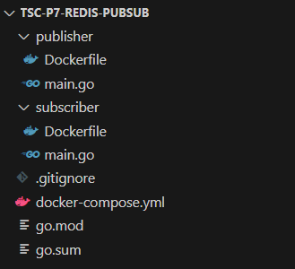
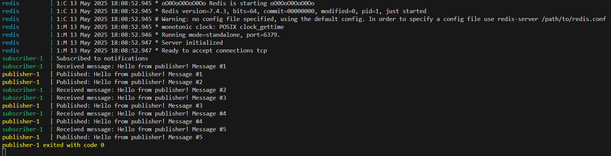

# Практическое задание 11: Redis pub/sub

Код проекта доступен [по ссылке](https://github.com/LeetManSup/tsc-p7-redis-pubsub/).

Структура проекта:



Пример образа публикатора `publisher/Dockerfile` (образ читателя построен по аналогии):
```Dockerfile
FROM golang:1.24-alpine

WORKDIR /app

COPY go.mod ./
COPY go.sum ./
RUN go mod download

COPY ./publisher .

RUN go build -o publisher .

CMD ["./publisher"]
```

Публикатор пишет 5 сообщений в топик `notifications` с интервалом в 2 секунды и завершает работу:

```go
package main

import (
    "context"
    "fmt"
    "os"
    "time"

    "github.com/redis/go-redis/v9"
)

func main() {
    ctx := context.Background()

    addr := os.Getenv("REDIS_ADDR")
    if addr == "" {
        addr = "localhost:6379"
    }

    rdb := redis.NewClient(&redis.Options{
        Addr: addr,
    })

    topic := "notifications"

    for i := 1; i <= 5; i++ {
        message := fmt.Sprintf("Hello from publisher! Message #%d", i)
        if err := rdb.Publish(ctx, topic, message).Err(); err != nil {
            fmt.Printf("Publish error: %v\n", err)
        } else {
            fmt.Printf("Published: %s\n", message)
        }
        time.Sleep(2 * time.Second)
    }
}
```

Читатель подписан на этот топик и выводит сообщения, которые читает из него:

```go
package main

import (
    "context"
    "fmt"
    "os"

    "github.com/redis/go-redis/v9"
)

func main() {
    ctx := context.Background()

    addr := os.Getenv("REDIS_ADDR")
    if addr == "" {
        addr = "localhost:6379"
    }

    rdb := redis.NewClient(&redis.Options{
        Addr: addr,
    })

    topic := "notifications"
    sub := rdb.Subscribe(ctx, topic)

    ch := sub.Channel()

    fmt.Println("Subscribed to", topic)

    for msg := range ch {
        fmt.Printf("Received message: %s\n", msg.Payload)
    }
}
```

Подтверждение работы:



Вывод недетерминирован, поскольку процессы параллельны.