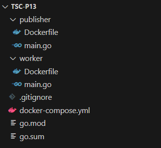
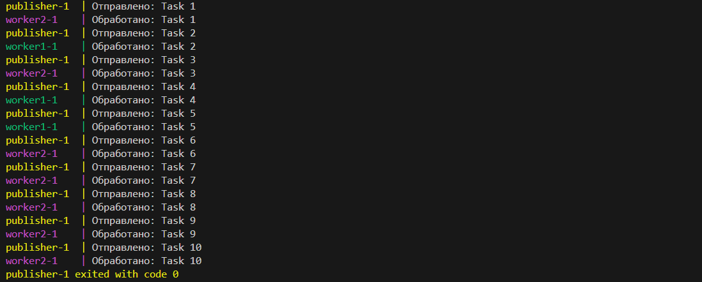

# Практическое задание 13: NATS

Код проекта доступен [по ссылке](https://github.com/LeetManSup/tsc-p13/).

Структура проекта:



`docker-compose.yml`:
```yml
services:
  nats:
    image: nats
    ports:
      - "4222:4222"
    container_name: nats

  publisher:
    build: ./publisher
    depends_on:
      - nats

  worker1:
    build: ./worker
    depends_on:
      - nats

  worker2:
    build: ./worker
    depends_on:
      - nats
```

Образ публикатора `publisher/Dockerfile`:
```Dockerfile
FROM golang:1.24-alpine

WORKDIR /app
COPY . .

RUN go mod init publisher && go get github.com/nats-io/nats.go && go build -o app

CMD ["./app"]
```

Образ воркера `worker/Dockerfile`:
```Dockerfile
FROM golang:1.24-alpine

WORKDIR /app
COPY . .

RUN go mod init worker && go get github.com/nats-io/nats.go && go build -o app

CMD ["./app"]
```

Публикатор `publisher/main.go`:
```go
package main

import (
	"fmt"
	"time"

	"github.com/nats-io/nats.go"
)

func main() {
	nc, err := nats.Connect("nats://nats:4222")
	if err != nil {
		panic(err)
	}
	defer nc.Close()

	for i := 1; i <= 10; i++ {
		msg := fmt.Sprintf("Task %d", i)
		err := nc.Publish("jobs.create", []byte(msg))
		if err != nil {
			fmt.Println("Ошибка при отправке:", err)
		} else {
			fmt.Println("Отправлено:", msg)
		}
		time.Sleep(1 * time.Second)
	}
}
```

Воркер `worker/main.go`:
```go
package main

import (
	"fmt"

	"github.com/nats-io/nats.go"
)

func main() {
	nc, err := nats.Connect("nats://nats:4222")
	if err != nil {
		panic(err)
	}
	defer nc.Close()

	nc.QueueSubscribe("jobs.create", "workers", func(m *nats.Msg) {
		fmt.Printf("Обработано: %s\n", string(m.Data))
	})

	select {} // Блокируем завершение
}
```

Распределение задач между воркерами:
