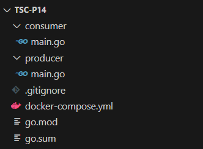
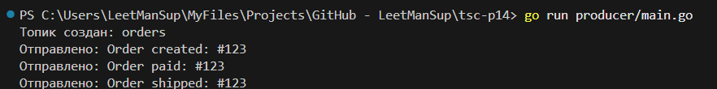
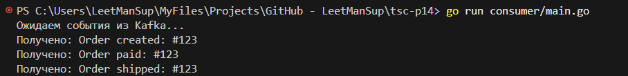

# Практическое задание 14: Kafka

Код проекта доступен [по ссылке](https://github.com/LeetManSup/tsc-p14/).

Структура проекта:



`docker-compose.yml`:
```yml
services:
  zookeeper:
    image: confluentinc/cp-zookeeper:latest
    container_name: zookeeper
    ports:
      - "2181:2181"
    environment:
      ZOOKEEPER_CLIENT_PORT: 2181

  kafka:
    image: confluentinc/cp-kafka:latest
    container_name: kafka
    ports:
      - "9092:9092"
    environment:
      KAFKA_ZOOKEEPER_CONNECT: zookeeper:2181
      KAFKA_ADVERTISED_LISTENERS: PLAINTEXT://localhost:9092
      KAFKA_LISTENERS: PLAINTEXT://0.0.0.0:9092
      KAFKA_OFFSETS_TOPIC_REPLICATION_FACTOR: 1

```

Производитель `producer/main.go`:
```go
package main

import (
	"context"
	"fmt"
	"time"

	"github.com/segmentio/kafka-go"
)

func main() {
	ensureTopic()
	writer := kafka.NewWriter(kafka.WriterConfig{
		Brokers:  []string{"localhost:9092"},
		Topic:    "orders",
		Balancer: &kafka.LeastBytes{},
	})
	defer writer.Close()

	events := []string{
		"Order created: #123",
		"Order paid: #123",
		"Order shipped: #123",
	}

	for _, e := range events {
		err := writer.WriteMessages(context.Background(), kafka.Message{
			Key:   []byte("Order123"),
			Value: []byte(e),
		})
		if err != nil {
			fmt.Println("Ошибка отправки:", err)
		} else {
			fmt.Println("Отправлено:", e)
		}
		time.Sleep(1 * time.Second)
	}
}

func ensureTopic() {
	conn, err := kafka.Dial("tcp", "localhost:9092")
	if err != nil {
		panic(err)
	}
	defer conn.Close()

	controller, err := conn.Controller()
	if err != nil {
		panic(err)
	}

	// подключаемся к контроллеру кластера
	connToController, err := kafka.Dial("tcp", controller.Host+":"+fmt.Sprint(controller.Port))
	if err != nil {
		panic(err)
	}
	defer connToController.Close()

	topic := "orders"
	topicConfigs := []kafka.TopicConfig{
		{
			Topic:             topic,
			NumPartitions:     1,
			ReplicationFactor: 1,
		},
	}

	err = connToController.CreateTopics(topicConfigs...)
	if err != nil {
		fmt.Println("Ошибка создания топика (возможно, уже существует):", err)
	} else {
		fmt.Println("Топик создан:", topic)
	}
}

```

Потребитель `consumer/main.go`:
```go
package main

import (
	"context"
	"fmt"

	"github.com/segmentio/kafka-go"
)

func main() {
	reader := kafka.NewReader(kafka.ReaderConfig{
		Brokers: []string{"localhost:9092"},
		Topic:   "orders",
		GroupID: "loggers",
	})
	defer reader.Close()

	fmt.Println("Ожидаем события из Kafka...")

	for {
		msg, err := reader.ReadMessage(context.Background())
		if err != nil {
			fmt.Println("Ошибка чтения:", err)
			continue
		}
		fmt.Printf("Получено: %s\n", string(msg.Value))
	}
}

```

Лог производителя:


Лог потребителя:


Развёртывается брокер Apache Kafka в Docker-контейнере, после чего из внешних Go-программ реализуются два микросервиса: продюсер, публикующий события о заказах (в данном случае, "Order created", "Order paid", "Order shipped") в топик orders, и консьюмер, подписанный на этот топик, который считывает события и выводит их в консоль. Таким образом демонстрируется событийная архитектура, при которой микросервисы обмениваются данными через Kafka с возможностью масштабирования, хранения истории и повторной обработки сообщений.

Zookeeper - это вспомогательный сервис, используемый Kafka для хранения метаданных, координации брокеров и выбора лидеров партиций в кластере. Он обеспечивает согласованность и надёжную работу распределённой системы, помогая Kafka отслеживать состояние узлов и управлять распределением нагрузки. В данной работе Zookeeper запускается в отдельном контейнере и необходим для корректной инициализации и функционирования Kafka-брокера.