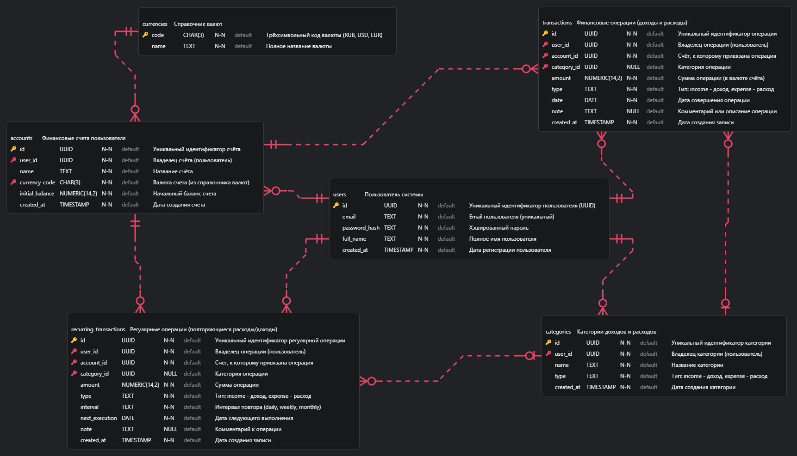
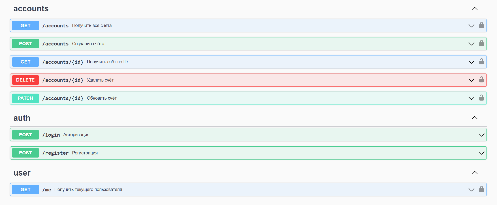
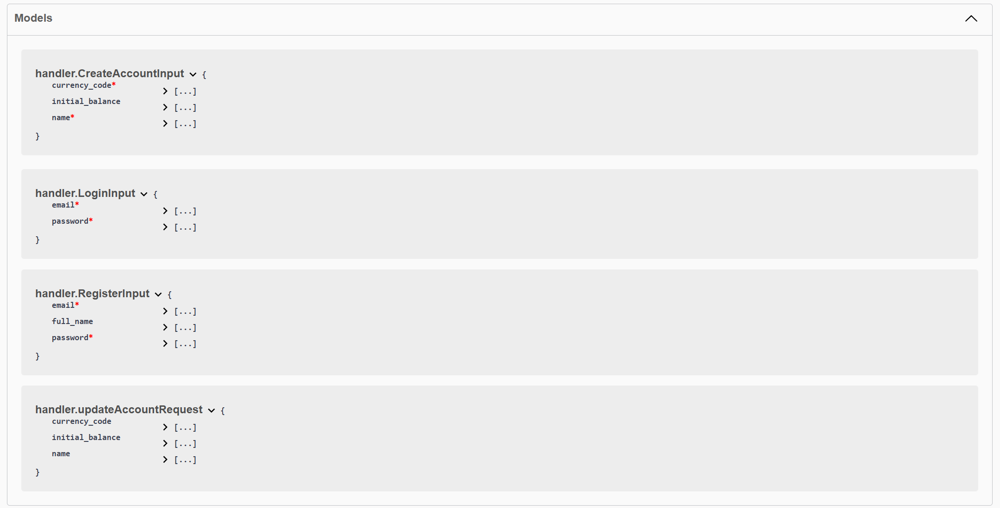

# Практическое задание 2: Проектирование базы данных и API

Код проекта доступен [по ссылке](https://github.com/LeetManSup/mirea_finance_tracker/).


## 1. Выбрать тип БД (PostgreSQL, MySQL и т. д.) и инструмент для работы с ней (GORM, sqlx, ent и т.д.)

**Выбранная СУБД**: PostgreSQL

**Инструмент для работы с БД**: GORM

## 2. Спроектировать схему БД



## 3. Описать REST API

### Общее описание API
- **Формат**: application/json
- **Аутентификация**: JWT (Bearer token) через Authorization заголовок
- **Все защищённые эндпоинты требуют передачи токена**
- **Ошибки возвращаются в формате**:
```json
{ "error": "Сообщение об ошибке" }
```

---

### Аутентификация и авторизация

`POST /register` - Регистрация нового пользователя

**Запрос**:
```json
{
  "email": "user@example.com",
  "password": "123456",
  "full_name": "User Name"
}
```

**Ответ**:
```json
{
  "token": "jwt-token"
}
```

---

`POST /login` - Вход в систему

**Запрос**:
```json
{
  "email": "user@example.com",
  "password": "123456"
}
```

**Ответ**:
```json
{
  "token": "jwt-token"
}
```

---

`GET /me` - Получить информацию о текущем пользователе (Требуется аутентификация)

**Ответ**:
```json
{
  "id": "uuid",
  "email": "user@example.com"
}
```

---

#### Аутентификация

Во всех защищённых запросах:

**Заголовок:**
```
Authorization: Bearer {jwt-token}
```


---

### Сущности
#### Пользователи - уже описаны выше

---

#### Счета (Accounts)

`POST /accounts` - Создать счёт

**Запрос**:
```json
{
  "name": "Карта Тинькофф",
  "currency_code": "RUB",
  "initial_balance": 25000
}
```

**Ответ**:
```json
{
  "account_id": "uuid"
}
```

---

`GET /accounts` - Список счетов пользователя

**Ответ**:
```json
[
  {
    "id": "uuid",
    "name": "Карта Тинькофф",
    "currency_code": "RUB",
    "initial_balance": 25000,
    "created_at": "2025-03-26T21:00:00Z"
  }
]
```

---

`GET /accounts/{id}` - Просмотр счёта по ID

**Ответ**:
```json
{
  "id": "uuid",
  "name": "Карта Тинькофф",
  "currency_code": "RUB",
  "initial_balance": 25000,
  "created_at": "2025-03-26T21:00:00Z"
}
```

---

`PATCH /accounts/{id}` - Редактирование счёта

**Запрос**:
```json
{
  "name": "Обновлённая карта",
  "currency_code": "USD",
  "initial_balance": 10000
}
```

**Ответ**:
```
204 No Content
```

---

`DELETE /accounts/{id}` - Удаление счёта

**Ответ**:
```
204 No Content
```

---

#### Транзакции (Transactions)

⚠️ Не реализованы. Планируются следующие эндпоинты:

`POST /transactions`

`GET /transactions`

`GET /transactions/{id}`

`PATCH /transactions/{id}`

`DELETE /transactions/{id}`

---

### Swagger (на реализованный CRUD)



