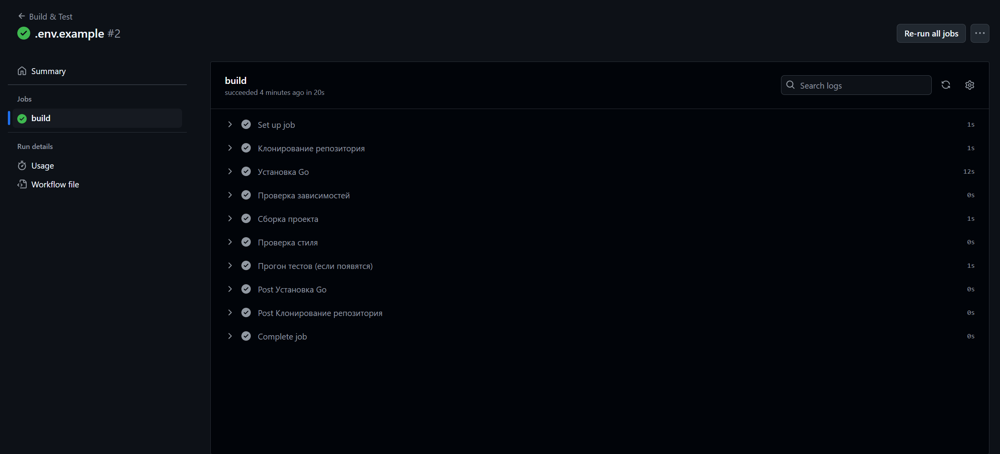

# Практическое задание 3: Разворачивание инфраструктуры и CI/CD

Код проекта доступен [по ссылке](https://github.com/LeetManSup/mirea_finance_tracker/).

## Dockerfile

```dockerfile
FROM golang:1.24.1-alpine AS builder

WORKDIR /app

COPY go.mod go.sum ./
RUN go mod download

COPY . .

RUN go build -o server ./cmd/server

FROM alpine:latest

WORKDIR /root/
COPY --from=builder /app/server .
COPY --from=builder /app/.env .env

EXPOSE 8080

CMD ["./server"]
```

---

## docker-compose.yml
```yml
services:
  app:
    build:
      context: .
      dockerfile: Dockerfile
    container_name: finance_api
    restart: always
    depends_on:
      - db
    ports:
      - "8081:8080"
    env_file:
      - .env

  db:
    image: postgres:17
    container_name: finance_db
    restart: always
    ports:
      - "5433:5432"
    env_file:
      - .env
    volumes:
      - ./db/init.sql:/docker-entrypoint-initdb.d/init.sql
      - postgres_data:/var/lib/postgresql/data

volumes:
  postgres_data:
```

---

## deploy.yml
```yml
name: Build & Test

on:
  push:
    branches: [main]

jobs:
  build:
    runs-on: ubuntu-latest

    steps:
      - name: Клонирование репозитория
        uses: actions/checkout@v3

      - name: Установка Go
        uses: actions/setup-go@v4
        with:
          go-version: '1.24.1'

      - name: Проверка зависимостей
        run: go mod tidy

      - name: Сборка проекта
        run: go build -v ./cmd/server

      - name: Проверка стиля
        run: go vet ./...

      - name: Прогон тестов (если появятся)
        run: go test ./... || true
```

