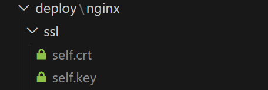
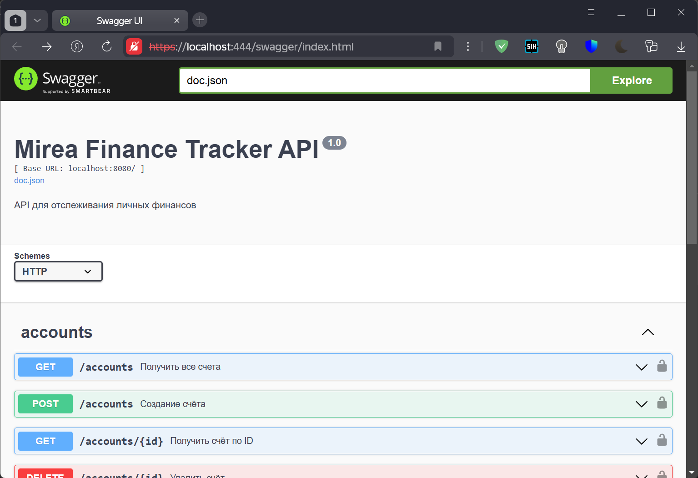
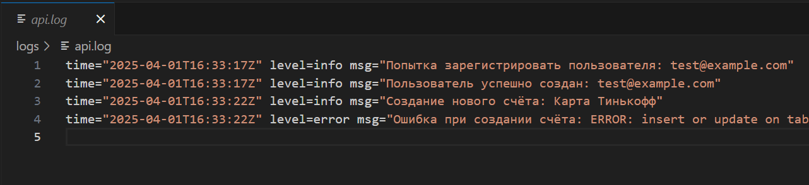

# Практическое задание 4: Настройка Nginx как Reverse Proxy для Go-приложения с элементами безопасности

Код проекта доступен [по ссылке](https://github.com/LeetManSup/mirea_finance_tracker/).

## Установка и настройка Nginx, балансировка нагрузки и меры безопасности

`deploy/nginx/default.conf`
```conf
limit_req_zone $binary_remote_addr zone=login_zone:10m rate=1r/s;

upstream finance_api {
    server app1:8080;
    server app2:8080;
    server app3:8080;
}

# HTTP → HTTPS редирект
server {
    listen 80;
    server_name localhost;

    return 301 https://$host$request_uri;
}

# HTTPS сервер
server {
    listen 443 ssl;
    server_name localhost;

    ssl_certificate     /etc/nginx/ssl/self.crt;
    ssl_certificate_key /etc/nginx/ssl/self.key;

    # Запрет нежелательных методов
    if ($request_method !~ ^(GET|POST|PATCH|DELETE)$) {
        return 405;
    }

    # Ограничение доступа к /admin по IP
    location /admin {
        allow 127.0.0.1;
        deny all;
    }

    # Замедление /login
    limit_req zone=login_zone burst=5 nodelay;

    location /login {
        proxy_pass http://finance_api/login;
        proxy_http_version 1.1;
        proxy_set_header Host $host;
        proxy_set_header X-Real-IP $remote_addr;
        proxy_set_header X-Forwarded-For $proxy_add_x_forwarded_for;
    }

    # Ограничение на размер запроса
    client_max_body_size 2M;

    # Проксирование всех остальных запросов
    location / {
        proxy_pass http://finance_api;
        proxy_http_version 1.1;
        proxy_set_header Host $host;
        proxy_set_header X-Real-IP $remote_addr;
        proxy_set_header X-Forwarded-For $proxy_add_x_forwarded_for;
    }

    # Скрытие версии Nginx
    server_tokens off;
}
```

`docker-compose.yml`

```yml
services:
  app1:
    build:
      context: .
      dockerfile: Dockerfile
    container_name: finance_api_1
    restart: always
    depends_on:
      - db
    expose:
      - "8080"
    env_file:
      - .env
    volumes:
      - ./logs:/app/logs

  app2:
    build:
      context: .
      dockerfile: Dockerfile
    container_name: finance_api_2
    restart: always
    depends_on:
      - db
    expose:
      - "8080"
    env_file:
      - .env
    volumes:
      - ./logs:/app/logs

  app3:
    build:
      context: .
      dockerfile: Dockerfile
    container_name: finance_api_3
    restart: always
    depends_on:
      - db
    expose:
      - "8080"
    env_file:
      - .env
    volumes:
      - ./logs:/app/logs

  db:
    image: postgres:17
    container_name: finance_db
    restart: always
    ports:
      - "5433:5432"
    env_file:
      - .env
    volumes:
      - ./db/init.sql:/docker-entrypoint-initdb.d/init.sql
      - postgres_data:/var/lib/postgresql/data

  nginx:
    image: nginx:stable
    container_name: finance_nginx
    ports:
      - "81:80"
      - "444:443"
    volumes:
      - ./deploy/nginx/default.conf:/etc/nginx/conf.d/default.conf
      - ./deploy/nginx/ssl:/etc/nginx/ssl
      - ./logs:/var/log/nginx
    depends_on:
      - app1
      - app2
      - app3

volumes:
  postgres_data:
```

## Настройка HTTPS:
```bash
openssl req -x509 -nodes -days 365 \
  -newkey rsa:2048 \
  -keyout ./deploy/nginx/ssl/self.key \
  -out ./deploy/nginx/ssl/self.crt \
  -subj "//C=RU/ST=Moscow/L=Moscow/O=Finance/CN=localhost"
```

Получил:



(Самоподписанный сертификат и приватный ключ соотвественно)

## Подтверждение доступности через HTTPS


## Логирование
`docker-compose.yml`
```yml
services:
  app1:
    ...
    volumes:
      - ./logs:/app/logs
  
  app2:
    ...
    volumes:
      - ./logs:/app/logs

  app3:
    ...
    volumes:
      - ./logs:/app/logs
```

`main.go`

Указание вывода логов:
```go
...
func main() {
    logFile, err := os.OpenFile("/app/logs/api.log", os.O_CREATE|os.O_WRONLY|os.O_APPEND, 0666)
        if err == nil {
            logrus.SetOutput(logFile)
        } else {
            logrus.Warn("Не удалось создать файл логов, используем stdout")
        }
...
```

Пример логируемой функции создания счёта:
```go
func (s *AccountService) CreateAccount(userID, name, currencyCode string, initialBalance float64) (uuid.UUID, error) {
	exists, err := s.currencyRepo.Exists(currencyCode)
	if err != nil || !exists {
		logrus.Errorf("Ошибка, неизвестная валюта: %v", err)
		return uuid.Nil, errors.New("invalid currency code")
	}

	account := model.Account{
		ID:             uuid.New(),
		UserID:         uuid.MustParse(userID),
		Name:           name,
		CurrencyCode:   currencyCode,
		InitialBalance: initialBalance,
	}

	logrus.Infof("Создание нового счёта: %s", account.Name)

	err = s.accountRepo.Create(&account)
	if err != nil {
		logrus.Errorf("Ошибка при создании счёта: %v", err)
		return uuid.Nil, err
	}

	logrus.Infof("Счёт успешно создан: %s", account.Name)
	return account.ID, nil
}
```

Пример логов:


