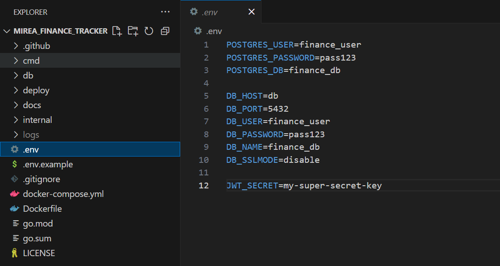

# Практическое задание 5: Работа с конфигурациями и логированием в Go

Код проекта доступен [по ссылке](https://github.com/LeetManSup/mirea_finance_tracker/).

## 1. Логирование
Установка пакета:
```bash
go get github.com/joho/godotenv
```

Пример файла:


Загрузка конфигурации в `internal/config/config.go`
```go
func Load() *Config {
	err := godotenv.Load()
	if err != nil {
		log.Println("Файл .env не найден, читаем переменные окружения напрямую")
	}

	return &Config{
		DBHost:     getEnv("DB_HOST", "localhost"),
		DBPort:     getEnv("DB_PORT", "5433"),
		DBUser:     getEnv("DB_USER", "finance_user"),
		DBPassword: getEnv("DB_PASSWORD", "pass123"),
		DBName:     getEnv("DB_NAME", "finance_db"),
		SSLMode:    getEnv("DB_SSLMODE", "disable"),
		JWTSecret:  os.Getenv("JWT_SECRET"),
	}
}
```

Использование переменных окружения в контейнерном экземпляре API:
```yaml
services:
  app1:
    build:
      context: .
      dockerfile: Dockerfile
    container_name: finance_api_1
    restart: always
    depends_on:
      - db
    expose:
      - "8080"
    env_file:
      - .env
    volumes:
      - ./logs:/app/logs
```

## 2. Логирование
Установка пакета:
```bash
go get github.com/sirupsen/logrus
```

Инициализация в `cmd/server/main.go`
```bash
func main() {
	logFile, err := os.OpenFile("/app/logs/api.log", os.O_CREATE|os.O_WRONLY|os.O_APPEND, 0666)
	if err == nil {
		logrus.SetOutput(logFile)
	} else {
		logrus.Warn("Не удалось создать файл логов, используем stdout")
	}
    ...
```

Пример логируемой функции создания счёта:
```go
func (s *AccountService) CreateAccount(userID, name, currencyCode string, initialBalance float64) (uuid.UUID, error) {
	exists, err := s.currencyRepo.Exists(currencyCode)
	if err != nil || !exists {
		logrus.Errorf("Ошибка, неизвестная валюта: %v", err)
		return uuid.Nil, errors.New("invalid currency code")
	}

	account := model.Account{
		ID:             uuid.New(),
		UserID:         uuid.MustParse(userID),
		Name:           name,
		CurrencyCode:   currencyCode,
		InitialBalance: initialBalance,
	}

	logrus.Infof("Создание нового счёта: %s", account.Name)

	err = s.accountRepo.Create(&account)
	if err != nil {
		logrus.Errorf("Ошибка при создании счёта: %v", err)
		return uuid.Nil, err
	}

	logrus.Infof("Счёт успешно создан: %s", account.Name)
	return account.ID, nil
}
```