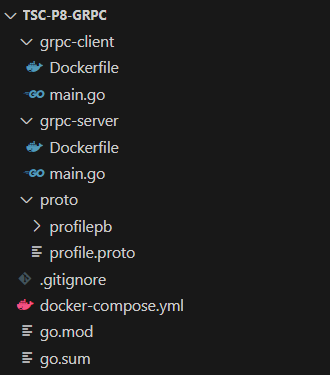
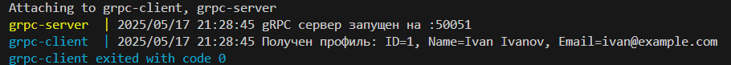
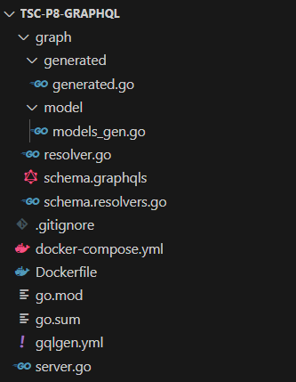
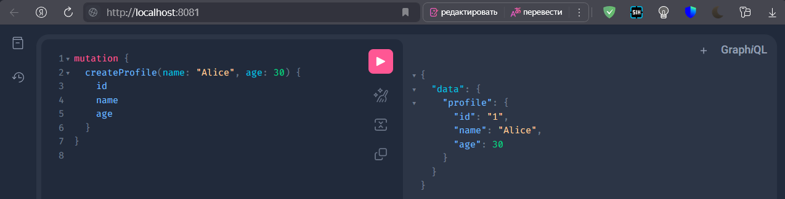
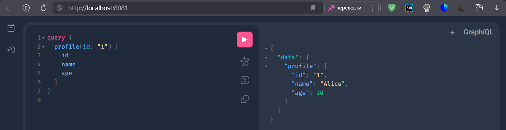
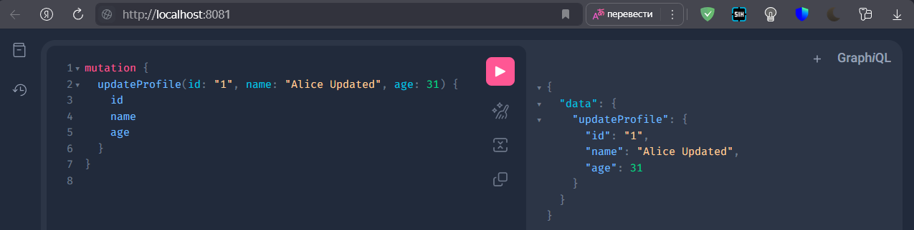
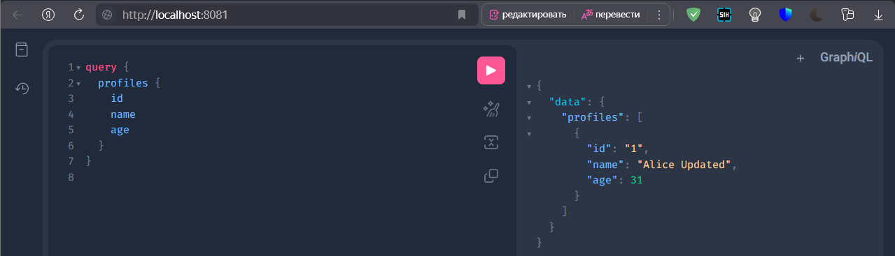

# Практическое задание 8: gRPC и GraphQL в Go

## 1. gRPC

Установка `protoc`:
```shell
winget install protobuf
```

Установка плагинов:
```shell
go install google.golang.org/protobuf/cmd/protoc-gen-go@latest
go install google.golang.org/grpc/cmd/protoc-gen-go-grpc@latest
```

Описание контракта между клиентом и сервером:
```proto
syntax = "proto3";

package profile;
option go_package = "./proto/profilepb";

service ProfileService {
  rpc GetProfile (ProfileRequest) returns (ProfileResponse);
}

message ProfileRequest {
  int32 id = 1;
}

message ProfileResponse {
  int32 id = 1;
  string name = 2;
  string email = 3;
}
```

Генерация кода (в корне проекта):
```shell
protoc --go_out=. --go-grpc_out=. proto/profile.proto
```

Структура проекта:



Сервер `grpc-server/main.go`:
```go
package main

import (
	"context"
	"log"
	"net"

	pb "tsc-p8-grpc/proto/profilepb"

	"google.golang.org/grpc"
)

type server struct {
	pb.UnimplementedProfileServiceServer
}

func (s *server) GetProfile(ctx context.Context, req *pb.ProfileRequest) (*pb.ProfileResponse, error) {
	return &pb.ProfileResponse{
		Id:    req.Id,
		Name:  "Ivan Ivanov",
		Email: "ivan@example.com",
	}, nil
}

func main() {
	lis, err := net.Listen("tcp", ":50051")
	if err != nil {
		log.Fatal("cannot listen:", err)
	}
	s := grpc.NewServer()
	pb.RegisterProfileServiceServer(s, &server{})
	log.Println("gRPC сервер запущен на :50051")
	if err := s.Serve(lis); err != nil {
		log.Fatal("cannot serve:", err)
	}
}
```

Клиент `grpc-client/main.go`:
```go
package main

import (
	"context"
	"log"
	"time"

	pb "tsc-p8-grpc/proto/profilepb"

	"google.golang.org/grpc"
)

func main() {
	conn, err := grpc.Dial("grpc-server:50051", grpc.WithInsecure())
	if err != nil {
		log.Fatal("не удалось подключиться:", err)
	}
	defer conn.Close()

	client := pb.NewProfileServiceClient(conn)
	ctx, cancel := context.WithTimeout(context.Background(), time.Second)
	defer cancel()

	resp, err := client.GetProfile(ctx, &pb.ProfileRequest{Id: 1})
	if err != nil {
		log.Fatal("ошибка при вызове:", err)
	}

	log.Printf("Получен профиль: ID=%d, Name=%s, Email=%s", resp.Id, resp.Name, resp.Email)
}
```

Клиент и сервер взаимодействуют по протоколу gRPC: клиент устанавливает соединение с сервером по адресу `grpc-server:50051` и вызывает удалённую процедуру, определённую в `.proto`-файле. Сервер обрабатывает входящий запрос, формирует ответ на основе бизнес-логики (в данном случае, возвращает профиль пользователя), и отправляет его обратно клиенту. Обмен сообщениями происходит в виде сериализованных структур Protocol Buffers, обеспечивая высокую производительность и типобезопасность при передаче данных.

Подтверждение работы:


## 2. GraphQL

Инициализация проекта:
```shell
go mod init tsc-p8-graphql
go install github.com/99designs/gqlgen@latest
```

Структура проекта:



Основа GraphQL API (`graph/schema.graphqls`): определяет сущность `Profile`, запросы `profile` и `profiles`, а также мутации `createProfile` и `updateProfile`:
```graphqls
type Profile {
  id: ID!
  name: String!
  age: Int!
}

type Query {
  profile(id: ID!): Profile
  profiles: [Profile!]!
}

type Mutation {
  createProfile(name: String!, age: Int!): Profile!
  updateProfile(id: ID!, name: String, age: Int): Profile!
}
```

Конфигурация для gqlgen (`gqlgen.yml`), определяющая путь к схеме; куда сгенерировать исполняемый код; папку с моделями; где будут лежать резолверы:
```yml
schema:
  - graph/schema.graphqls

exec:
  filename: graph/generated/generated.go
  package: generated

model:
  filename: graph/model/models_gen.go
  package: model

resolver:
  layout: follow-schema
  dir: graph
  package: graph
```

Генерация движка GraphQL, моделей данных и заготовок резолверов:
```shell
go run github.com/99designs/gqlgen@latest generate
```

Реализация резолверов:
`graph/resolver.go`:
```go
package graph

import "tsc-p8-graphql/graph/model"

type Resolver struct {
	profiles []*model.Profile
}
```

`graph/schema.resolvers.go`
```go
package graph

import (
	"context"
	"tsc-p8-graphql/graph/generated"
	"tsc-p8-graphql/graph/model"
	"strconv"
)

var idCounter = 1

func (r *Resolver) Mutation() generated.MutationResolver {
	return &mutationResolver{r}
}

func (r *Resolver) Query() generated.QueryResolver {
	return &queryResolver{r}
}

type queryResolver struct{ *Resolver }

func (r *queryResolver) Profiles(ctx context.Context) ([]*model.Profile, error) {
	return r.profiles, nil
}

func (r *queryResolver) Profile(ctx context.Context, id string) (*model.Profile, error) {
	for _, p := range r.profiles {
		if p.ID == id {
			return p, nil
		}
	}
	return nil, nil
}

type mutationResolver struct{ *Resolver }

func (r *mutationResolver) CreateProfile(ctx context.Context, name string, age int) (*model.Profile, error) {
	profile := &model.Profile{
		ID:   strconv.Itoa(idCounter),
		Name: name,
		Age:  age,
	}
	idCounter++
	r.profiles = append(r.profiles, profile)
	return profile, nil
}

func (r *mutationResolver) UpdateProfile(ctx context.Context, id string, name *string, age *int) (*model.Profile, error) {
	for _, p := range r.profiles {
		if p.ID == id {
			if name != nil {
				p.Name = *name
			}
			if age != nil {
				p.Age = *age
			}
			return p, nil
		}
	}
	return nil, nil
}
```

Точка входа `server.go`:
```go
package main

import (
	"log"
	"net/http"
	"os"

	"tsc-p8-graphql/graph"
	"tsc-p8-graphql/graph/generated"

	"github.com/99designs/gqlgen/graphql/handler"
	"github.com/99designs/gqlgen/graphql/playground"
)

const defaultPort = "8080"

func main() {
	port := os.Getenv("PORT")
	if port == "" {
		port = defaultPort
	}

	srv := handler.NewDefaultServer(generated.NewExecutableSchema(generated.Config{Resolvers: &graph.Resolver{}}))

	http.Handle("/", playground.Handler("GraphQL playground", "/query"))
	http.Handle("/query", srv)

	log.Printf("Server started at http://localhost:%s/", port)
	log.Fatal(http.ListenAndServe(":"+port, nil))
}
```

Образ `Dockerfile`
```Dockerfile
FROM golang:1.21-alpine

WORKDIR /app

COPY go.mod go.sum ./
RUN go mod download

COPY . .

RUN go build -o graphql-server .

EXPOSE 8080

CMD ["./graphql-server"]
```

`docker-compose.yml`:
```yml
services:
  graphql:
    build:
      context: .
      dockerfile: Dockerfile
    ports:
      - "8081:8080"
```

Подтверждение работы:

Создание профиля:


Получение профиля по ID:


Обновление профиля:


Просмотр существующих профилей:


## 3. Сравнение REST API, gRPC, GrapgQL
| Критерий               | REST                                                                                | gRPC                                                                         | GraphQL                                                                                    |
| ---------------------- | ----------------------------------------------------------------------------------- | ---------------------------------------------------------------------------- | ------------------------------------------------------------------------------------------ |
| **Производительность** | Текстовый формат (JSON), избыточность данных, высокая нагрузка при больших ответах. | Быстрый бинарный формат (Protocol Buffers), низкие накладные расходы.        | Зависит от схемы и запроса: можно получить только нужные поля, но требует парсинга.        |
| **Читаемость**         | Прост, человекочитаем, легко отлаживать вручную.                                    | Менее читаем (бинарный формат), требует инструментария.                      | Читабельный синтаксис, удобный для клиентов; требуется schema-awareness.                   |
| **Масштабируемость**   | Хорошо подходит для простых API, но может страдать от избыточности при комплексных. | Отличен для микросервисной архитектуры, строго типизирован.                  | Эффективен на клиентской стороне, но требует дополнительной логики на сервере.             |
| **Поддержка**          | Широкая поддержка во всех языках и инструментах.                                    | Поддерживается в большинстве популярных языков, требует компиляции protobuf. | Хорошо интегрируется в веб-среду, множество клиентов и инструментов (Apollo, Relay и др.). |

- `REST` - универсален, прост в использовании и совместим с большинством систем.
- `gRPC` - оптимален для высоконагруженных внутренних API и микросервисов.
- `GraphQL` - даёт гибкость клиенту, особенно в интерфейсных приложениях, где важен выбор полей.