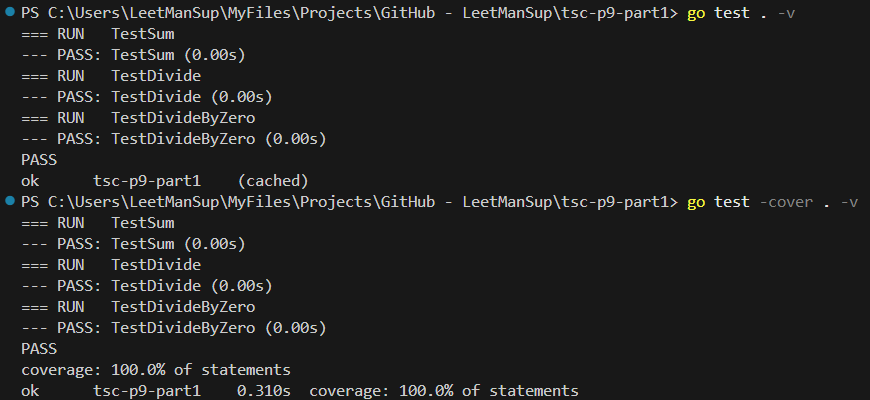
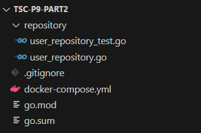
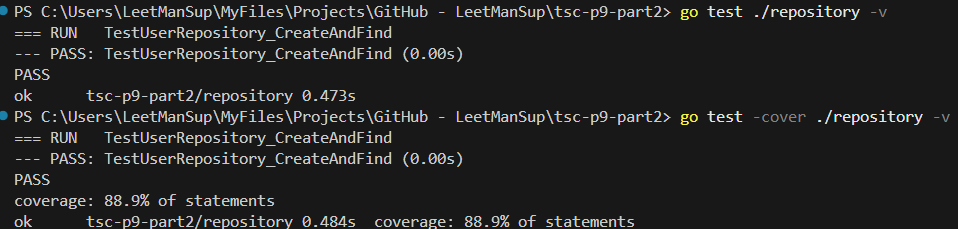
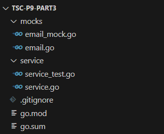
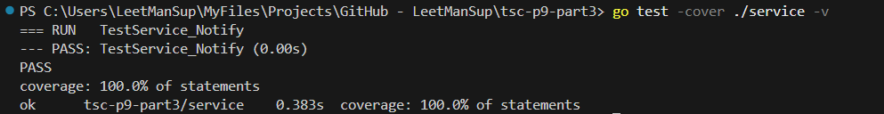

# Практическое задание 8: gRPC и GraphQL в Go

## Часть 1. Unit-тесты

Код проекта доступен [по ссылке](https://github.com/LeetManSup/tsc-p9-part1/).

Тестируемый модуль `sum.go`:
```go
package calc

import "fmt"

// Sum возвращает сумму двух чисел
func Sum(a, b int) int {
	return a + b
}

// Divide выполняет деление a на b, с защитой от деления на 0
func Divide(a, b int) (int, error) {
	if b == 0 {
		return 0, fmt.Errorf("division by zero")
	}
	return a / b, nil
}
```

Тестирующий модуль `sum_test.go`:
```go
package calc

import "testing"

// Тестируем обычную сумму
func TestSum(t *testing.T) {
	result := Sum(2, 3)
	expected := 5
	if result != expected {
		t.Errorf("Sum(2, 3) = %d; want %d", result, expected)
	}
}

// Тестируем деление с результатом
func TestDivide(t *testing.T) {
	result, err := Divide(6, 2)
	if err != nil {
		t.Fatalf("unexpected error: %v", err)
	}
	expected := 3
	if result != expected {
		t.Errorf("Divide(6, 2) = %d; want %d", result, expected)
	}
}

// Тестируем деление на ноль
func TestDivideByZero(t *testing.T) {
	_, err := Divide(10, 0)
	if err == nil {
		t.Error("expected error on division by zero, got nil")
	}
}
```

Результаты тестирования и покрытия:


## Часть 2. Интеграционные тесты с базой данных

Код проекта доступен [по ссылке](https://github.com/LeetManSup/tsc-p9-part2/).

Структура проекта:



БД в контейнере. `docker-compose.yml`:
```yml
services:
  db:
    image: postgres:15
    environment:
      POSTGRES_USER: test
      POSTGRES_PASSWORD: test
      POSTGRES_DB: testdb
    ports:
      - "5433:5432"
    healthcheck:
      test: ["CMD", "pg_isready", "-U", "test"]
      interval: 5s
      timeout: 5s
      retries: 5
```

Тестируемый модуль `repository/user_repository.go`:
```go
package repository

import (
	"database/sql"
)

type User struct {
	ID   int
	Name string
}

type UserRepository struct {
	db *sql.DB
}

func NewUserRepository(db *sql.DB) *UserRepository {
	return &UserRepository{db: db}
}

func (r *UserRepository) Create(user User) error {
	_, err := r.db.Exec("INSERT INTO users (id, name) VALUES ($1, $2)", user.ID, user.Name)
	return err
}

func (r *UserRepository) Find(id int) (*User, error) {
	row := r.db.QueryRow("SELECT id, name FROM users WHERE id = $1", id)
	var user User
	err := row.Scan(&user.ID, &user.Name)
	if err != nil {
		return nil, err
	}
	return &user, nil
}
```

Тестирующий модуль `repository/user_repository_test.go`:
```go
package repository

import (
	"database/sql"
	"log"
	"os"
	"testing"
	"time"

	_ "github.com/lib/pq"
)

var testDB *sql.DB

func TestMain(m *testing.M) {
	// Подключаемся к тестовой БД
	var err error
	dsn := "host=localhost port=5433 user=test password=test dbname=testdb sslmode=disable"
	for i := 0; i < 10; i++ {
		testDB, err = sql.Open("postgres", dsn)
		if err == nil && testDB.Ping() == nil {
			break
		}
		log.Println("Waiting for DB...")
		time.Sleep(2 * time.Second)
	}
	if err != nil {
		log.Fatalf("could not connect to test db: %v", err)
	}

	// Создаём таблицу
	_, err = testDB.Exec(`DROP TABLE IF EXISTS users; CREATE TABLE users (id INT PRIMARY KEY, name TEXT)`)
	if err != nil {
		log.Fatalf("could not create table: %v", err)
	}

	code := m.Run()
	testDB.Close()
	os.Exit(code)
}

func TestUserRepository_CreateAndFind(t *testing.T) {
	repo := NewUserRepository(testDB)

	// Добавляем пользователя
	user := User{ID: 1, Name: "Alice"}
	err := repo.Create(user)
	if err != nil {
		t.Fatalf("failed to insert user: %v", err)
	}

	// Извлекаем пользователя
	got, err := repo.Find(1)
	if err != nil {
		t.Fatalf("failed to get user: %v", err)
	}

	if got.Name != "Alice" {
		t.Errorf("expected name 'Alice', got '%s'", got.Name)
	}
}
```

Тестирование и покрытие:


## Часть 3. Интеграционные тесты с базой данных

Код проекта доступен [по ссылке](https://github.com/LeetManSup/tsc-p9-part3/).

Структура проекта:



Интерфейс `EmailSender` `mocks/email.go`:
```go
package mocks

// EmailSender описывает поведение отправщика писем
type EmailSender interface {
	Send(to, subject, body string) error
}
```

Ручная заглушка `mocks/email_mock.go` (Calls — срез вызовов, чтобы потом проверить, что функция реально вызывалась):
```go
package mocks

import "fmt"

type MockEmailSender struct {
	Calls []string
}

func (m *MockEmailSender) Send(to, subject, body string) error {
	// Логируем вызов
	m.Calls = append(m.Calls, fmt.Sprintf("%s|%s|%s", to, subject, body))
	return nil
}
```

Сервис, использующий EmailSender (`service/service.go`), Notify() делегирует отправку письма через интерфейc, что позволяет в тесте подменить реализацию:
```go
package service

import "tsc-p9-part3/mocks"

type Service struct {
	sender mocks.EmailSender
}

func NewService(sender mocks.EmailSender) *Service {
	return &Service{sender: sender}
}

func (s *Service) Notify(to, subject, body string) error {
	return s.sender.Send(to, subject, body)
}
```

Тестирование сервиса с мок-объектом (`service/service_test.go`):
```go
package service

import (
	"testing"
	"tsc-p9-part3/mocks"

	"github.com/stretchr/testify/require"
)

func TestService_Notify(t *testing.T) {
	mock := &mocks.MockEmailSender{}

	s := NewService(mock)

	err := s.Notify("user@example.com", "Hello", "Test body")
	require.NoError(t, err)

	require.Len(t, mock.Calls, 1)
	require.Contains(t, mock.Calls[0], "user@example.com")
}
```

Результат тестирования:


## Часть 4: Покрытие кода и CI

Выполнено в [практической работе 3](https://github.com/LeetManSup/techSoftwareCreating/blob/main/semester2/Prac3/README.md)